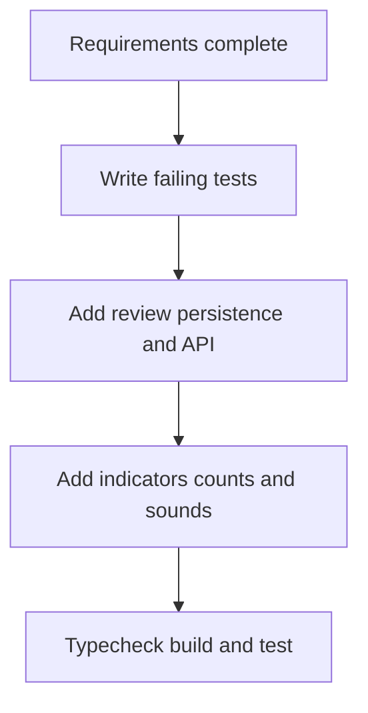

# Conversation status indicators execution plan

## Impact

- **User-facing**: Conversation rows, filters, settings, completion feedback
- **Data model**: Authenticated per-conversation review state and one sound preference
- **API**: Session list status output and mark-reviewed endpoint
- **Risk**: Medium. Existing session refresh, WebSocket, and push paths must stay compatible.
- **Rollback**: Remove the additive table, endpoint, preference field, and UI treatment.

## Component relationships

- `public/app.js` renders sessions and handles completion events.
- `public/index.html` provides filters and notification settings.
- `public/styles.css` styles state dots, labels, and counts.
- `src/server.ts` returns review status and accepts reviewed updates.
- `src/conversation-reviews.ts` owns SQLite review persistence.
- `src/preferences.ts` owns the completion sound preference.
- `public/sw.js` displays push notifications.

## Workflow

Text alternative: requirements, failing tests, persistence and API, UI and sounds, then validation.

## Stages

- [x] Workspace detection and reverse-engineering context
- [x] Requirements analysis
- [x] Workflow planning
- [x] User stories skipped because one administrator workflow has explicit acceptance criteria
- [x] Application design skipped because changes stay within existing browser, API, and persistence boundaries
- [x] Units generation skipped because this is one cohesive unit
- [x] Functional and infrastructure design skipped because no new service or deployment resource is needed
- [x] Code generation
- [x] Build and test

## Success criteria

- Tests prove account persistence and status transitions.
- Existing chats do not create a false review backlog.
- UI displays and filters all three states with counts.
- Notification and sound controls work without new dependencies.
