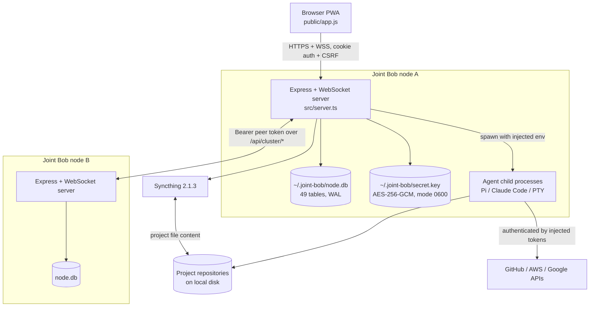
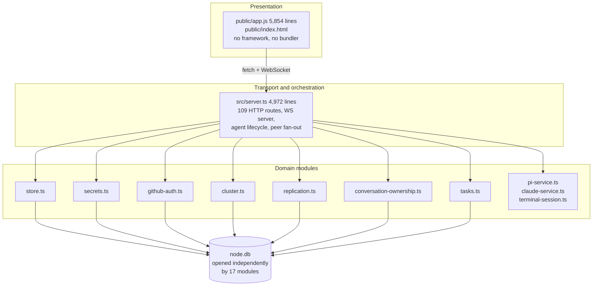
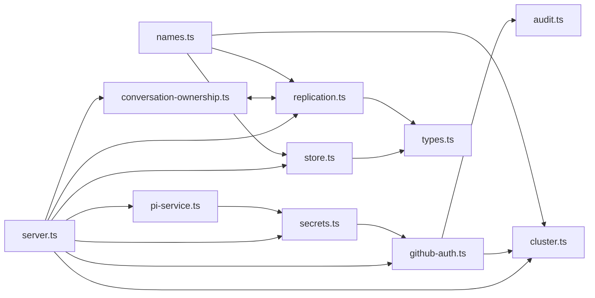
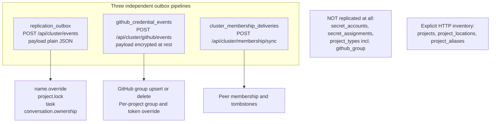
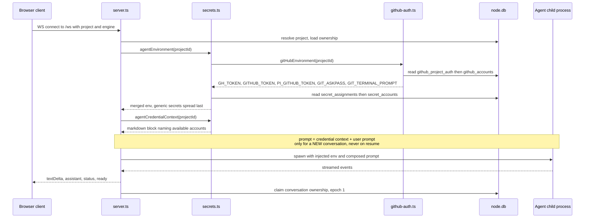
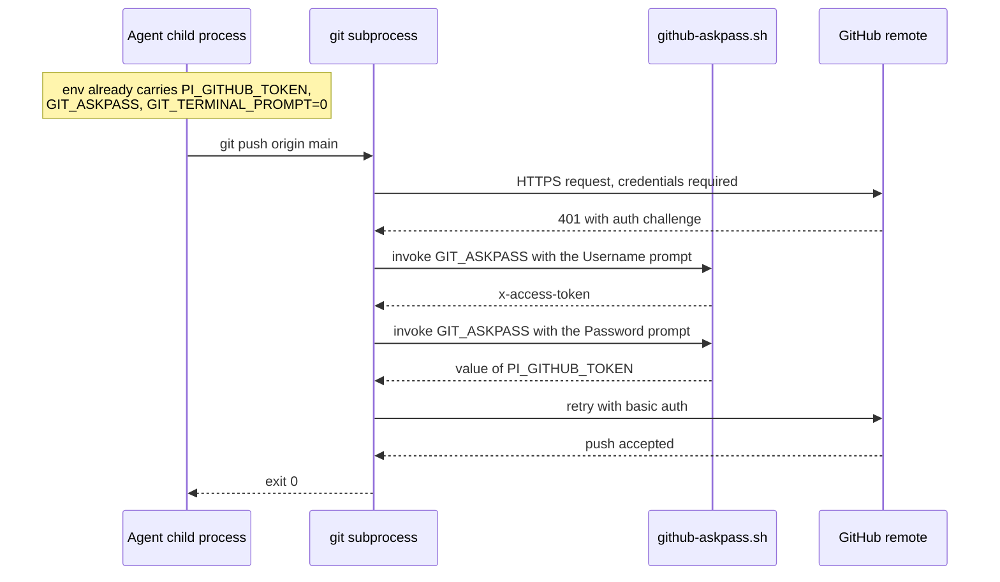
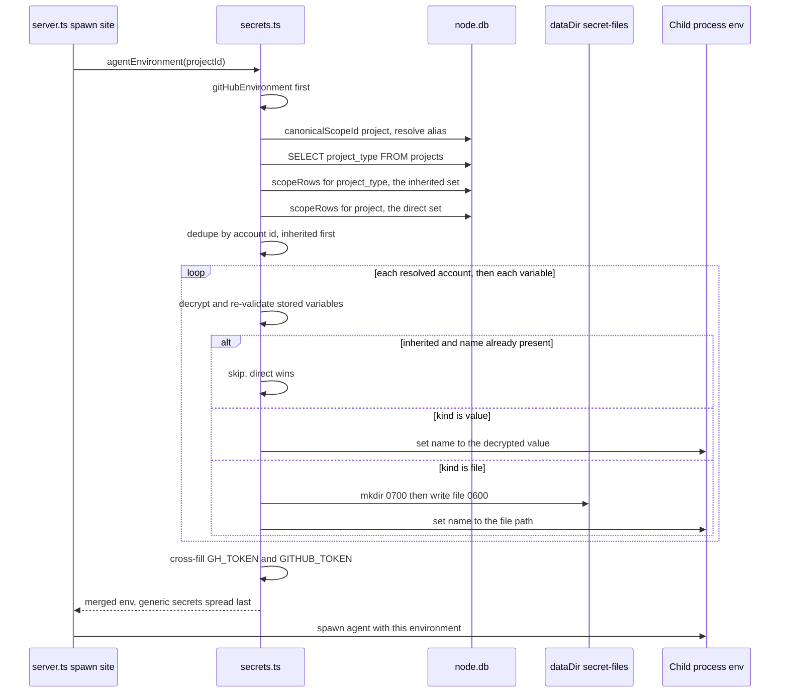
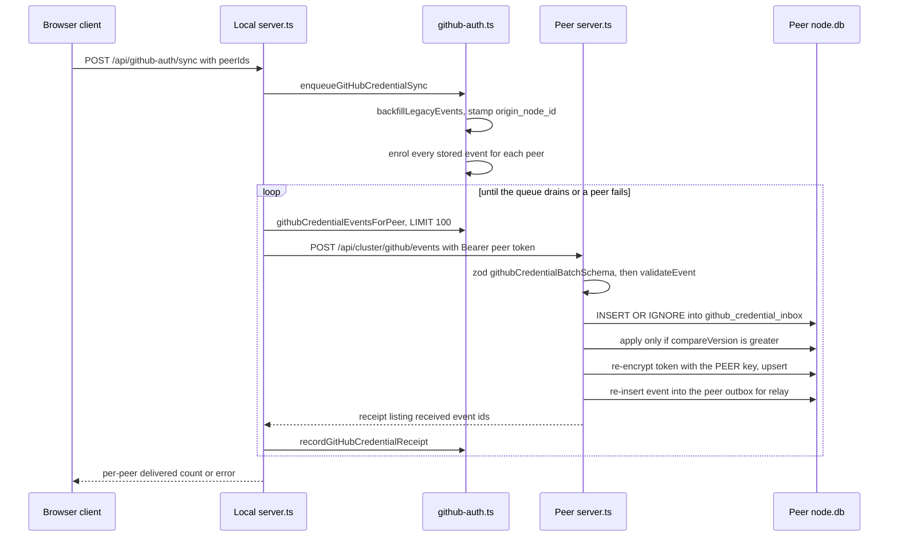

# Architecture — Joint Bob

Scanned at commit `c3e9b0508fba185dbc4ab8bb7ad5fa6debadd5fa` on branch `main`.
Every file path, symbol, and line number below is quoted as the scan reported it.

## Architectural style in one paragraph

Joint Bob is a **single-process, single-file-database, no-build monolith replicated across a small
mesh of peer nodes**. One Node.js process per node serves an Express HTTP API, a WebSocket server,
and a static PWA client; all persistent state is in one SQLite file opened directly through Node's
built-in `node:sqlite`; agents run as child processes of that same server process, receiving their
credentials as environment variables at spawn. There is no service boundary, no message broker, no
external database, and no cache. Cross-node behaviour is achieved with three hand-rolled
event-outbox pipelines over authenticated HTTP, plus Syncthing for file content.

## System context



**Text fallback.** The browser talks only to the node it is pointed at, over HTTPS and WSS with
cookie authentication plus CSRF. That node owns one SQLite file and one encryption key, spawns
agent child processes with credentials injected as environment variables, and reaches peer nodes
over the same HTTP surface using a bearer peer token. Project file content moves between nodes
through Syncthing, never through the API. Agents reach GitHub, AWS, and Google directly, using
only what the server put in their environment.

## Layering

There are three honest layers and one thing that cuts across all of them.



**Text fallback.** A framework-free browser client calls one very large route module, which calls
domain modules. There is no repository or DAO layer: each domain module opens its own
`DatabaseSync` handle to the same file and owns its own `CREATE TABLE IF NOT EXISTS` statements.
That is the cross-cutting fact — **17 modules independently own parts of a 49-table database, and
there is no schema-version table, no migration list, and no single schema owner.**

## Patterns actually in use

| Pattern | Where | Notes |
|---|---|---|
| Module-scoped singleton DB handle | every persistence module | `store.ts:46-47` keeps `database` plus a shared `databaseInitialization` promise so concurrent first callers cannot build rival handles |
| Lazy schema creation | all 17 DB modules | `CREATE TABLE IF NOT EXISTS` on first use; creation order is import-order dependent, which is why `secrets.ts:115` needs `hasTable()` guards |
| Additive column migration | `store.ts:385`, `github-auth.ts:102-110`, `replication.ts:44-56`, `cluster.ts:215` | `tableHasColumn()` then `ALTER TABLE ... ADD COLUMN` |
| Full table rebuild | `store.ts:289`, `conversation-ownership.ts:51` | used only when a `CHECK` constraint must be dropped |
| Marker / digest tables | `github_auth_migrations`, `github_legacy_file_migrations`, `name_override_migrations`, `cluster_secret_migrations`, `task_migrations`, `push_migrations` | the substitute for a schema version |
| Event outbox with delivery receipts | `replication.ts`, `github-auth.ts`, `cluster.ts` | three separate implementations of the same idea |
| Last-writer-wins with node tie-break | `store.ts:146`, `github-auth.ts:228`, `replication.ts:100` | compare `updated_at`, tie-break `origin_node_id.localeCompare` — three syntaxes, one rule |
| Tombstones | 5 hand-rolled sets | `github_account_tombstones`, `github_project_auth_tombstones`, `name_override_tombstones`, `task_tombstones`, `cluster_member_tombstones` |
| Optimistic fencing with epochs | `conversation-ownership.ts` | CAS on `(engine, sessionId)` with a monotonic epoch and a terminal `conflict` state |
| Envelope encryption at rest | `secrets.ts:31-63`, `github-auth.ts:40-72`, plus near-copies in `cluster.ts` and `push.ts` | AES-256-GCM, 12-byte IV, serialised `iv.authTag.body` in base64 |
| Validation at every boundary | `src/server.ts` zod schemas, plus in-module re-validation | inbound replication events are validated twice, independently |

## Component relationships



**Text fallback and the edges that matter.**

- `server.ts` imports every other module. It is the only place peer fan-out happens.
- **`secrets.ts` → `github-auth.ts` at `secrets.ts:6` is the single import edge between the two
  credential systems.** `agentEnvironment()` composes both; nothing else joins them.
- `conversation-ownership.ts` ⇄ `replication.ts` is a genuine **mutual import**: `replication.ts:6`
  pulls `applyConversationOwnershipEvent` and `ensureConversationOwnershipSchema`, while
  `conversation-ownership.ts:5` pulls `enqueueReplicationEvent` and `ensureReplicationSchema`.
- **`store.ts` depends on `types.ts` only.** Projects deliberately do *not* travel through the
  replication outbox; they cross nodes through explicit HTTP inventory calls
  (`POST /api/cluster/projects/import`, `/map`, `/discover`).
- `pi-service.ts` → `secrets.ts` is how the Pi adapter gets its spawn environment.

## Data architecture

One SQLite file, `~/.joint-bob/node.db`, in WAL mode with `PRAGMA foreign_keys = ON`, resolved
identically in 17 modules as
`process.env.JOINT_BOB_DATA_DIR ?? process.env.PI_WEB_DATA_DIR ?? path.join(os.homedir(), ".joint-bob")`.

```
~/.joint-bob/
  node.db                                # 49 tables, WAL
  secret.key                             # base64 32-byte AES-256-GCM key, mode 0600
  github-askpass.sh                       # generated GIT_ASKPASS helper, mode 0700
  secret-files/<accountId>/<VAR_NAME>      # file-kind secret material, mode 0600 in a 0700 dir
  env                                     # node-local environment overrides
  logs/push-deploy.log
```

Domain data groups by owner module, not by schema:

| Owner | Tables |
|---|---|
| `store.ts` | `projects`, `project_locations`, `project_aliases`, `project_types` |
| `secrets.ts` | `secret_accounts`, `secret_assignments` |
| `github-auth.ts` | `github_accounts`, `github_project_auth`, both tombstone tables, `github_credential_events`, `github_credential_deliveries`, `github_credential_inbox`, `github_auth_migrations`, `github_legacy_file_migrations` |
| `replication.ts` | `replication_outbox`, `replication_inbox`, `replication_deliveries` (and it also owns `ensureTaskSchema`) |
| `cluster.ts` | `cluster_node`, `cluster_peers`, `cluster_machine_credentials`, `cluster_membership_state`, `cluster_membership_deliveries`, `cluster_member_tombstones`, `cluster_secret_migrations` |
| `conversation-ownership.ts` | `conversation_ownership` |
| others | `tasks`, `task_*`, `name_overrides`, `name_override_*`, `users`, `login_*`, `node_settings`, `user_preferences`, `push_*`, `audit_events`, `project_locks`, `conversation_review_*`, `claude_runtime_sessions`, `update_recoveries` |

Full DDL for the tables in this intent's blast radius is in
[component-inventory.md](component-inventory.md).

## Multi-node architecture — three replication pipelines



**Text fallback and the decisive asymmetry.** Generic replication carries exactly four entity
types and auto-enrols every outbox row for a peer the moment that peer's queue is read
(`replication.ts:75`). The GitHub credential pipeline carries only what an explicit user sync
enrolled (`github-auth.ts:487`), encrypts its payload at rest but sends it as plaintext JSON over
the authenticated peer link, and re-inserts every applied event into the receiver's own outbox so
it can relay onward. Membership has a third pipeline in `cluster.ts`. Both credential-bearing
generic-secret tables and the whole `project_types` table — including its `github_group` column —
travel through **none** of them.

The retry expression `Math.min(300, 2 ** Math.min(attempts, 8))` is byte-identical at
`replication.ts:81` and `github-auth.ts:544`.

## Security architecture

- **Perimeter.** `app.use("/api", requireHttpAuth, requireCsrf)` at `server.ts:848`. Four routes
  are registered before it and are therefore unauthenticated by design: `GET /api/auth/status`
  (794), `GET /api/health` (798), `POST /api/auth/setup` (809), `POST /api/auth/login` (829).
- **Peer authentication.** `Authorization: Bearer <peer token>`; the token is stored encrypted in
  `cluster_peers.token` and decrypted on use.
- **CSP** (`server.ts:487`): `default-src 'self'; connect-src 'self' ws: wss:; img-src 'self' data:; style-src 'self'; script-src 'self'` — no inline script, no external origin, which is why the client draws provider brand icons inline rather than fetching them.
- **Encryption at rest.** Every token, every secret variable, the VAPID keypair, and every peer
  token is AES-256-GCM encrypted with the node's `secret.key`. The key comes from
  `JOINT_BOB_SECRET_KEY ?? MASTER_BOB_SECRET_KEY` if set, else the file, else a freshly generated
  32 bytes written at mode `0600`.
- **Secrets never reach the browser.** Only metadata is served.
- **Blast-radius limiter.** `.stignore` excludes `.git`, `node_modules/`, `dist/`, `.env*`,
  `*.pem`, `*.key`, `id_rsa*`, `.joint-bob/`, `credentials.json`, and `service-account*.json` from
  Syncthing at every depth, so credential material cannot leak through file sync.
- **Known gap.** The embedded terminal receives no credentials at all
  (`terminal-session.ts:26` spawns with `env: { ...process.env, TERM: "xterm-256color" }`), so the
  same project is authenticated for the agent and unauthenticated for the human's shell.

---

## Interaction Diagrams

These three flows are the real business transactions this codebase exists to perform.

### 1. Starting an agent session



**Text fallback.** The client opens a WebSocket. The server resolves the project, then calls
`agentEnvironment(projectId)`, which is the *only* place the two credential systems meet: it
computes the GitHub group environment first and the generic secret environment second and merges
them, generic last. It also builds `agentCredentialContext(projectId)`, a Markdown block that tells
the agent which CLIs are already authenticated — prepended to the **first** prompt of a new
conversation only, never on resume (`server.ts:3762`, `server.ts:4152`, `pi-service.ts:334`). The
agent is spawned as a child process with that environment. Streamed events are relayed to the
browser. Ownership of the conversation is claimed in `conversation_ownership`.

The four spawn sites are `pi-service.ts:330`, `server.ts:3766` (Claude chat), `server.ts:3851`
(Claude task run), and `server.ts:4195` (Claude connection). **Injection happens once, at spawn.**
For a brand-new Pi conversation the id is only read back *after* creation
(`server.ts:3802-3806`), so a conversation-scoped credential cannot be resolved by the current
single-shot contract.

### 2. A git push using GitHub credentials



**Text fallback.** There is **no in-process git push anywhere in the codebase.** `src/worktrees.ts`
runs `git` via `execFileAsync` for `status`, `rev-parse`, `show-ref`, `merge-base`, `merge`,
`worktree add/remove/list`, `branch`, `bundle`, `fetch`, and `check-ref-format`, but never `push`.
The agent runs `git push` itself inside its own shell. Git finds it needs credentials, sees
`GIT_ASKPASS` pointing at `~/.joint-bob/github-askpass.sh`, and executes that script twice — once
for the username, where the script prints `x-access-token`, and once for the password, where the
script prints `$PI_GITHUB_TOKEN`. `GIT_TERMINAL_PROMPT=0` prevents any interactive fallback. The
script is regenerated at mode `0700` on **every** `gitHubEnvironment()` call (`github-auth.ts:219`).

The architectural consequence is blunt: **the environment contract is the push contract.** Any
change to what `agentEnvironment` exports changes whether `git push` works, and only
`gitHubEnvironment` supplies `PI_GITHUB_TOKEN` — a generic `github`-provider secret account
overrides `GH_TOKEN` and `GITHUB_TOKEN` but leaves `PI_GITHUB_TOKEN` alone, so `gh` and `git push`
can act as different identities.

### 3. Secret resolution and injection into an agent process



**Text fallback.** `agentEnvironment(projectId)` at `secrets.ts:235` is literally
`{ ...gitHubEnvironment(projectId), ...genericSecretEnvironment(projectId) }`. The generic half
resolves in two tiers: the project's canonical id (resolved through `project_aliases`) gives the
*direct* accounts; the project's `project_type` gives the *inherited* accounts. Inherited rows are
emitted first, deduplicated by account id, and a `if (!direct && variable.name in values) continue`
guard means a project-scoped account overrides a project-type-scoped one for the same variable name.
Same-scope collisions are rejected outright at **assignment** time by `assertNoCollision`
(`secrets.ts:139`); cross-scope collisions are permitted and resolved silently by precedence at
**injection** time (`secrets.ts:214`).

File-kind variables are written to `<dataDir>/secret-files/<accountId>/<VAR_NAME>` at mode `0600`
inside a `0700` directory on **every** injection, and the variable exports the *path*, not the
content. Nothing removes those files when a session ends — only account save or delete calls
`clearFiles`.

Finally the `GH_TOKEN` ⇄ `GITHUB_TOKEN` cross-fill runs, because "the gh CLI reads `GH_TOKEN` while
most other GitHub tooling reads `GITHUB_TOKEN`, so one pasted token fills both"
(`secrets.ts:229`).

### 4. Pushing GitHub credentials to a peer node

Included because it is the only path by which credential material crosses a machine boundary.



**Text fallback.** Enrolment is explicit and user-initiated; nothing syncs on its own. Legacy rows
created before node identity existed are stamped and turned into synthetic events first. Events go
out in batches of at most 100 over the authenticated peer link with a 10-second timeout. The
receiving node validates twice — a strict zod union at the HTTP boundary and `validateEvent` inside
the module — dedupes through an inbox table so delivery is at-least-once but application is
idempotent, re-keys project events through the alias table, applies last-writer-wins by
`compareVersion`, **re-encrypts each token with its own key** rather than sharing a key, and
re-inserts the event into its own outbox so a three-node mesh converges. A peer that acknowledges
nothing raises `"Peer acknowledged no events"` rather than looping forever on the same batch.

## Architectural constraints a change must respect

1. **The environment contract is the credential contract.** Everything downstream — `gh`, `git
   push`, `aws`, `gcloud` — depends only on what four spawn sites put in a child process's
   environment.
2. **Injection is single-shot at spawn.** There is no mechanism to change an agent's environment
   after it starts, and no conversation id exists yet for a new Pi conversation at that moment.
3. **There is no migration owner.** A schema change must either introduce one or follow the
   existing per-module marker-table convention, which is what every prior change did.
4. **Two peers may run different builds.** The GitHub pipeline explicitly still accepts the
   pre-groups bare-string account shape from older peers, so any wire-format change needs the same
   tolerance.
5. **Project identity is aliased.** `resolveProjectId` / `resolveProjectAlias` is implemented three
   times, and `rekeyProjectState` (`store.ts:249`) re-keys tasks, handoffs, names, and GitHub
   project auth on an alias merge — **but not `secret_assignments`**, which are silently stranded
   today.
6. **Project types are filesystem-coupled.** Their id is a directory name; changing a project's
   type relocates the directory and reconfigures Syncthing.
