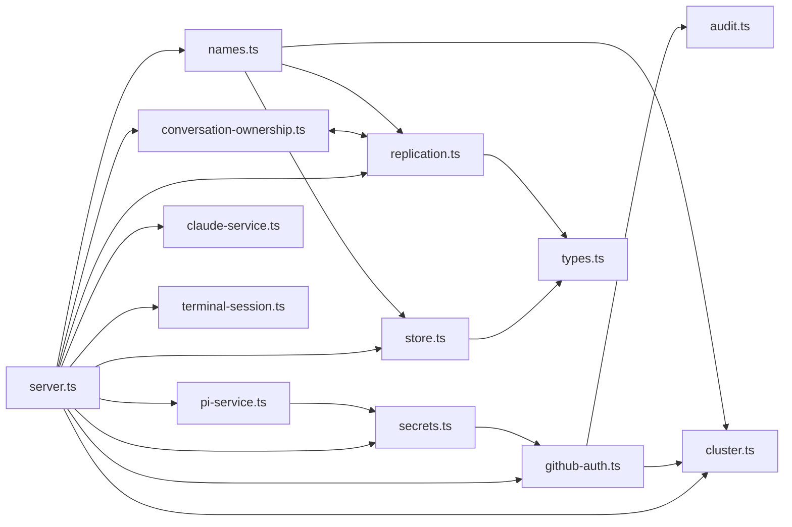

# Dependencies — Joint Bob

Two kinds of dependency matter here: **external packages and binaries** the product pulls in, and
**internal module edges** between the 36 files in `src/`. The internal edges are the ones that
constrain change.

## External npm dependencies

Nine runtime dependencies, six dev dependencies. Full version table with declared-versus-resolved
values is in [technology-stack.md](technology-stack.md); the summary here is about *why* each one
is present and what depends on it.

| Package | Resolved | Depended on by | Removal difficulty |
|---|---|---|---|
| `@anthropic-ai/claude-code` | 2.1.239 | `src/claude-service.ts`, `src/claude-runtime.ts`, `src/server.ts` | impossible — it is half the product |
| `@earendil-works/pi-coding-agent` | 0.84.2 | `src/pi-service.ts` | impossible — it is the other half |
| `express` | 4.22.2 | `src/server.ts` only | moderate; 109 routes and 8 middleware registrations |
| `ws` | 8.21.3 | `src/server.ts`, `src/terminal-session.ts` | moderate |
| `zod` | 3.25.76 | `src/server.ts` (schema block 265-322), `src/terminal-session.ts` | moderate; it is the outer of two validation layers |
| `node-pty` | 1.2.0-beta.15 | `src/terminal-session.ts` only | easy to isolate, hard to replace — native, beta |
| `nanoid` | 5.1.16 | `src/store.ts:490` | trivial |
| `web-push` | 3.6.7 | `src/push.ts` only | easy |
| `codemirror` | 5.65.16 | served to the browser via `server.ts:790` | easy to isolate; end-of-life line |

**Deliberately absent.** No ORM, no query builder, no migration library, no crypto library, no test
framework, no linter, no formatter, no bundler, no HTTP client (native `fetch`), no logging library,
no dependency-injection container, no state-management library. Every one of those roles is filled
by a Node built-in or by hand-written code. See [technology-stack.md](technology-stack.md) for the
built-ins carrying that weight.

## External binaries

| Binary | Pinned | Installed by the app | Depended on by |
|---|---|---|---|
| Node.js | 22.23.2 | yes (`scripts/install-node-runtime.sh`) | everything |
| Syncthing | 2.1.3, SHA-256 checksummed per platform | yes (`scripts/install-syncthing.sh`) | `src/syncthing.ts` |
| Pi CLI | 0.84.2 | yes | `src/pi-service.ts` |
| Claude Code CLI | 2.1.239 | yes | `src/claude-service.ts` |
| `git` | not pinned | no | `src/worktrees.ts` (via `execFileAsync`), and the **agent's own shell for `git push`** |
| `gh` | not pinned | no | the agent's shell only; reaches it through `GH_TOKEN` |
| Tailscale | not pinned | no | optional, for private HTTPS via `tailscale serve` |

## Internal module dependency graph



**Text fallback.** `server.ts` imports every other module and is the only place peer fan-out
happens. The credential systems join at exactly one edge. Conversation ownership and generic
replication import each other. The project store depends on nothing but shared types.

### The edges that constrain change

| Edge | Line | Why it matters |
|---|---|---|
| **`secrets.ts` → `github-auth.ts`** | `secrets.ts:6` | The **only** import edge between the two credential systems. `agentEnvironment()` composes both; nothing else joins them. Unifying the two models means either collapsing this edge or replacing both sides. |
| `github-auth.ts` → `audit.ts` | — | `appendAuditEvent`, `ensureAuditSchema`; every credential mutation writes an audit event inside the same transaction |
| `github-auth.ts` → `cluster.ts` | — | `getClusterNode` — needed to stamp `origin_node_id` on every version |
| **`conversation-ownership.ts` ⇄ `replication.ts`** | `replication.ts:6`, `conversation-ownership.ts:5` | A genuine **mutual import**. `replication.ts` pulls `applyConversationOwnershipEvent` and `ensureConversationOwnershipSchema`; `conversation-ownership.ts` pulls `enqueueReplicationEvent` and `ensureReplicationSchema`. Adding a new replicated entity type means touching this cycle. |
| `names.ts` → `cluster.ts`, `replication.ts`, `store.ts` | — | The template for "a module that replicates through the generic outbox" |
| **`store.ts` → `types.ts` only** | — | The project store deliberately does **not** replicate. Projects cross nodes through explicit HTTP inventory calls (`POST /api/cluster/projects/import`, `/map`, `/discover`). |
| `pi-service.ts` → `secrets.ts` | `pi-service.ts:330`, `:334` | The Pi spawn hook and credential context |
| `replication.ts` → `types.ts` | — | `PROJECT_COLORS`, `TaskRecord` |

### Shared-database coupling (not visible as imports)

**17 modules independently open `~/.joint-bob/node.db`:**

```
src/audit.ts            src/auth.ts             src/claude-runtime.ts
src/cluster.ts          src/conversation-ownership.ts
src/conversation-reviews.ts                     src/github-auth.ts
src/names.ts            src/preferences.ts      src/project-locks.ts
src/push.ts             src/replication.ts      src/secrets.ts
src/settings.ts         src/store.ts            src/tasks.ts
src/update-recovery.ts
```

This creates coupling that no import graph shows. Concrete consequences:

- **`secrets.ts` reads `projects`, `project_aliases`, and `project_types` by raw SQL** even though
  it does not import `store.ts`. That is why `canonicalScopeId` needs `hasTable(...)` guards
  (`secrets.ts:115`) — table creation order depends on which module is imported first, and is not
  deterministic.
- **`github-auth.ts` reads `projects` and `project_types` by raw SQL** for
  `projectTypeGroupId(projectId)` (line 272), which joins `projects.project_type` to
  `project_types.id`.
- **`store.ts:236` adds `github_project_auth.origin_node_id` opportunistically**, from inside its own
  re-key routine, to a table it does not own.
- **`replication.ts` owns `ensureTaskSchema`** (line 35) — the schema for `tasks`, which `tasks.ts`
  uses — and carries private duplicates of `ensureNameSchema` (52) and `ensureProjectLockSchema`
  (59) that `names.ts` and `project-locks.ts` also declare.

### Duplicated helpers (a dependency on convention, not on code)

| Helper | Copies | Locations |
|---|---|---|
| AES-256-GCM `key()` / `encrypt()` / `decrypt()` | 2 verbatim + 2 near-copies | `secrets.ts:31-63`, `github-auth.ts:40-72`, plus `cluster.ts` and `push.ts` |
| Project alias resolution | 3 | `store.ts:120` (`resolveProjectId`), `github-auth.ts:237`, `replication.ts:83` |
| `compareVersion` last-writer-wins rule | 2 named + 1 inline | `store.ts:146`, `github-auth.ts:228`, inline string form in `replication.ts:100`, `:118`, `:141`, `:145` |
| Retry backoff `Math.min(300, 2 ** Math.min(attempts, 8))` | 2, **byte-identical** | `replication.ts:81`, `github-auth.ts:544` |
| Tombstone handling | 5 hand-rolled sets, no shared abstraction | `github_account_tombstones`, `github_project_auth_tombstones`, `name_override_tombstones`, `task_tombstones`, `cluster_member_tombstones` |

## Data dependencies between tables

Foreign keys exist only inside the project store:

```
projects.id  ←  project_locations.project_id   ON DELETE CASCADE
projects.id  ←  project_aliases.project_id     ON DELETE CASCADE
```

Everything else is a **logical** reference with no database constraint behind it:

| From | To | Enforced by | Gap |
|---|---|---|---|
| `secret_assignments.account_id` | `secret_accounts.id` | nothing | no FK; an orphan is possible |
| `secret_assignments.scope_id` (scope_type `project`) | `projects.id` | `canonicalScopeId` at write time only | **not re-keyed on alias merge, not deleted with the project** |
| `secret_assignments.scope_id` (scope_type `project_type`) | `project_types.id` | `canonicalScopeId` at write time only | **not deleted when the project type is deleted** |
| `github_project_auth.project_id` | `projects.id` | `resolveProjectAlias` at read and write | re-keyed on alias merge (`rekeyProjectGitHubAuth`, `store.ts:232`), but **not deleted with the project** |
| `github_project_auth.account` | `github_accounts.account` | resolution falls through a dangling reference | intentional — a deleted group must not block the chain |
| `project_types.github_group` | `github_accounts.account` | resolution falls through | intentional |
| `projects.project_type` | `project_types.id` | `deleteProjectType` refuses while any project uses the type | the `CHECK` constraint that used to enforce this was deliberately dropped (`store.ts:289`) |
| `conversation_ownership.session_id` | a transcript on disk | nothing | three different derivations of the id exist |

**The three live defects in this table** are all in the same family and all touch the current
intent: `secret_assignments` is never re-keyed on an alias merge, never cleaned up on project
delete, and never cleaned up on project-type delete.

## What crosses a node boundary, and how

| Data | Table(s) | Replicates? | Mechanism |
|---|---|---|---|
| GitHub group id/label/token/default | `github_accounts` + tombstones | **Yes, on explicit user action** | `github_credential_events` → `POST /api/cluster/github/events` |
| Per-project group + token override | `github_project_auth` + tombstones | **Yes, on explicit user action** | same pipeline |
| Project type → GitHub group mapping | `project_types.github_group` | **No** | in no replication path |
| Project types themselves | `project_types` | **No** | in no replication path |
| Generic secret accounts | `secret_accounts` | **No — deliberately node-local** | none |
| Generic secret assignments | `secret_assignments` | **No — deliberately node-local** | none |
| Project records | `projects`, `project_locations`, `project_aliases` | **Yes** | explicit HTTP inventory (`POST /api/cluster/projects/import`, `/map`, `/discover`), not the outbox |
| Names / colours | `name_overrides` + tombstones | Yes | `replication_outbox` pipeline |
| Project locks | `project_locks` | Yes | `replication_outbox` pipeline |
| Tasks | `tasks`, `task_tombstones` | Yes | `replication_outbox` pipeline |
| Conversation ownership | `conversation_ownership` | Yes | `replication_outbox` pipeline |
| Cluster membership | `cluster_peers`, `cluster_membership_*`, `cluster_member_tombstones` | Yes | a **third** pipeline in `cluster.ts` |
| Project file content | — | Yes | Syncthing, with a `.stignore` that excludes every credential-shaped file |

**The asymmetry that any unified secrets model must resolve explicitly:** a project type's
`githubGroup` assignment does **not** cross nodes, but the group's token **does**.

## Other credential material and its boundary

- `cluster_peers.token` — peer bearer tokens, encrypted at rest, migrated in place by
  `cluster_secret_migrations` version 1 (`cluster.ts:219-226`)
- `cluster_machine_credentials` — the singleton machine token returned by `getClusterMachineToken()`
  (`cluster.ts:262`), used as the pairing token. `README.md`: *"Do not pair nodes over plain public
  HTTP because pairing tokens are machine credentials."*
- `push_vapid_keys` — the VAPID keypair, encrypted in `push.ts`
- Per `README.md`: *"Pi authentication/model credential files and Claude credentials,
  credential-bearing settings, MCP authentication, OAuth locks, and daemon control keys remain
  node-local"* and *"GitHub credentials never sync automatically. Push them from Settings > GitHub >
  Sync to nodes, which uses encrypted cluster replication, never filesystem sync."*
- `.stignore` excludes `*.pem`, `*.key`, `id_rsa*`, `id_ed25519*`, `id_ecdsa*`, `.env*`,
  `credentials.json`, `service-account*.json`, and `.joint-bob/` from Syncthing at every depth.

## Client-side dependencies

The browser client has **no package dependencies at all**. Its only third-party code is vendored
xterm.js (`public/vendor/xterm/`) and CodeMirror 5 served from `node_modules` at
`/vendor/codemirror`. Internally it has three independent module-level caches — `githubGroups`,
`projectTypes`, `secretAccounts` — each refreshed by a full reload after every mutation, with no
shared state container.

## Blast radius of a credential-model change

Files that must change together for any rework of the secrets model:

**Certain:** `src/secrets.ts`, `src/github-auth.ts`, `src/server.ts` (zod block 265-322, route
handlers 1729-1787 and 1899-1945, injection sites 3762/3766/3851/4152/4195, peer push 4881-4907),
`src/store.ts` (`rekeyProjectState` 249, `removeProject` 624, `deleteProjectType` 693),
`public/app.js` (260-400, 1245-1520, 2055-2085, 4673-4700, 5670-5870), `public/index.html`
(278-300, 310-400, 435-475, 727-775), `src/types.ts`.

**Likely:** `src/pi-service.ts` (330, 334), `src/replication.ts` (if the new model replicates),
`src/cluster.ts` (if a new pipeline is needed), `src/terminal-session.ts` (if the terminal is to be
credentialed), `src/audit.ts` (new event names).

**Tests in the blast radius** (21 named files): `secrets.test.ts`, `secrets-ui.test.ts`,
`github-account-groups.test.ts`, `github-auth-sync.test.ts`, `github-auth-mesh-api.test.ts`,
`github-sync-api.test.ts`, `settings-github-groups-placement.test.ts`, `project-type-api.test.ts`,
`project-types.test.ts`, `project-type-migration.test.ts`, `project-store.test.ts`,
`project-alias-mesh-api.test.ts`, `conversation-ownership.test.ts`,
`conversation-ownership-mesh-api.test.ts`, `replication.test.ts`, `replication-mesh-api.test.ts`,
`settings-tabs-ui.test.ts`, `project-row-menu.test.ts`, `cluster.test.ts`, `cluster-mesh-api.test.ts`,
`audit.test.ts`.

`test/github-account-groups.test.ts` alone asserts the full fallback chain — project override →
project group → project-type group → default group — including fall-through past a deleted group and
the legacy `sela` / `personal` labels.
