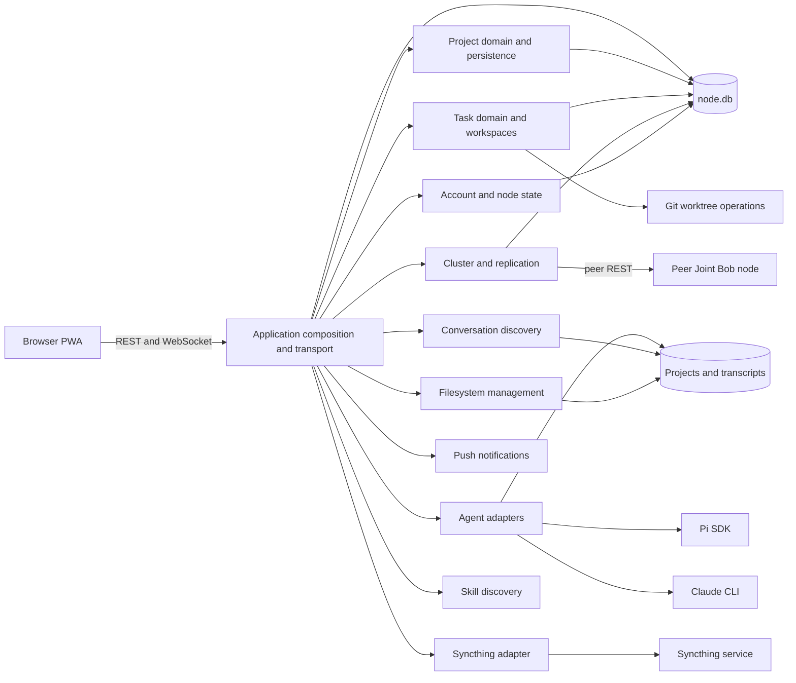
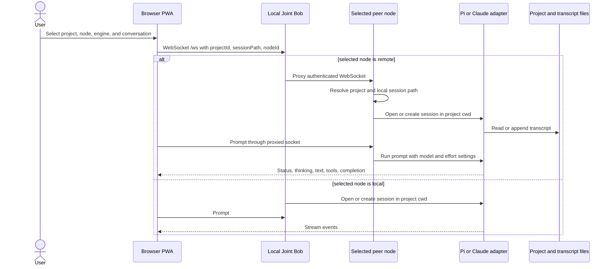
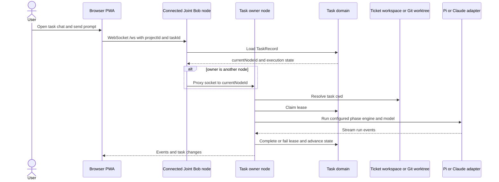
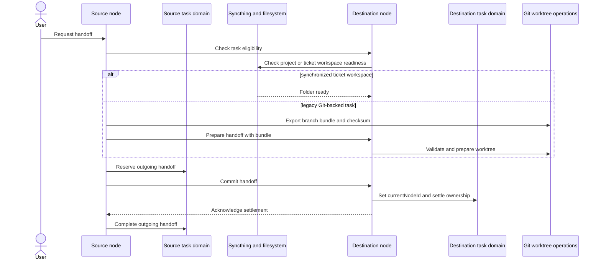
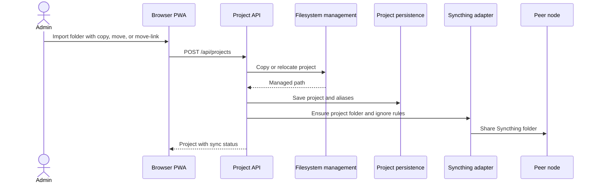

# Architecture

## Architecture analysis

### System overview

Joint Bob is a stateful Node.js application deployed once per participating machine. One process hosts an Express REST API, a `ws` WebSocket endpoint, static PWA files, peer proxying, background reconciliation, and agent execution. Nodes communicate directly over HTTP and WebSocket. Syncthing handles selected filesystem replication outside the process.

The dominant style is a modular monolith with peer-to-peer cluster behavior. The TypeScript modules separate persistence and integration concerns, but `src/server.ts` remains the 3,521-line composition root and workflow orchestrator. Modules share one node-local SQLite file and often open independent handles to it, so data ownership is weaker than the source-file boundaries suggest.

### Component relationships

**Plain-text fallback:** Browser PWA calls the Node transport. The transport coordinates account, project, task, cluster, agent, discovery, sync, push, filesystem, skill, and Git modules. Application state goes to node-local SQLite; repositories and transcripts stay on disk. Peer nodes use REST and proxied WebSockets. Syncthing, Pi, and Claude are external processes or runtimes.

## Interaction diagrams

### Non-task chat on the UI-selected node

**Plain-text fallback:** The browser puts the selected `nodeId` in the WebSocket URL. The local server handles local execution or proxies the socket to the chosen peer. The node that terminates the socket resolves the project path, opens Pi or Claude in that directory, and streams events back over the same connection.

### Task chat and ownership routing

**Plain-text fallback:** Task routing reads `TaskRecord.currentNodeId`; it does not honor a non-task UI node override. The owner node resolves the ticket workspace or legacy worktree, claims a lease, executes the configured phase through Pi or Claude, records the outcome, and streams updates to the browser.

### Task handoff between nodes

**Plain-text fallback:** Source and destination first verify eligibility. Ticket workspaces rely on Syncthing readiness. Legacy worktrees use a checksummed Git bundle. A prepare, commit, settle, and acknowledgement protocol moves `currentNodeId` while preserving recoverable handoff state.

### Project import and synchronization

**Plain-text fallback:** The API validates an import request, copies or relocates the directory, saves project aliases in SQLite, configures a Syncthing folder with ignore rules, shares it with peers, and returns project sync state.

## Data flow and ownership

| Data | Current owner | Storage and movement |
|---|---|---|
| Administrator, login sessions, preferences, settings, audit | Account and node-state modules | Tables in `~/.joint-bob/node.db`; sensitive settings encrypted with AES-256-GCM |
| Projects, aliases, types, locations, names | Project modules | SQLite plus filesystem paths; selected names and mappings replicate |
| Tasks, leases, handoffs, outboxes | Task and replication modules | SQLite transactions, peer REST, retry reconciliation |
| Repositories and worktrees | Filesystem and Git modules | Local disk; Git subprocesses and branch bundles |
| Ticket workspaces and shareable engine data | Filesystem and Syncthing adapter | Local disk synchronized by Syncthing |
| Pi and Claude transcripts | Agent adapters and discovery | Engine-owned filesystem JSON or JSONL files |
| GitHub, peer, push, and settings secrets | Credential-owning modules | Encrypted SQLite records using a local mode-`0600` key |
| PWA shell | Static server and service worker | `public/`, cache `joint-bob-v25` |

The source declares 43 SQLite tables and 23 guarded `ALTER TABLE` statements across modules. There is no central migration version or ordered migration runner.

## Observed design decisions and trade-offs

No ADRs record the original alternatives. The alternatives below are architectural comparisons, not claims about historical team decisions.

1. **Single deployable process instead of independent services.** This keeps installation, private-network operation, and debugging simple. It also concentrates routing and reconciliation in `src/server.ts` and scales all capabilities together. Separate services would isolate failures and ownership but add deployment and distributed-operations cost.
2. **Node-local SQLite plus filesystem ownership instead of a central database.** Nodes can operate near local repositories and agent installations without a central control plane. Replication, path mapping, tombstones, handoff settlement, and conflict handling become application responsibilities. A central store would simplify consistency but weaken local autonomy and require network availability.
3. **Syncthing for file replication instead of application-level file transfer.** Syncthing supplies device and folder synchronization while Joint Bob manages readiness and ignore policy. This creates an external operational dependency and eventual-consistency boundary. Direct file transfer would increase application code and security responsibility.
4. **Native browser modules instead of a frontend framework and build pipeline.** Static files package and serve directly. The cost is a 3,568-line `public/app.js`, manually duplicated contracts, no frontend static types, and source-regex tests.
5. **Pi SDK adapter plus Claude CLI adapter.** Joint Bob can expose two engines through one UI, but their model and reasoning controls are not symmetrical. Pi exposes runtime thinking APIs; Claude uses CLI `--effort`. Claude runs with `--permission-mode bypassPermissions`.

Security depends on authenticated administration, strict WebSocket origin checks, encrypted secrets, private networking, and filesystem boundaries. No compliance regime is documented. The symlink-following project file download and bypassable agent safeguards make filesystem isolation a material boundary.

## Coupling hotspots and architectural risks

- `src/server.ts` imports nearly every backend module and owns HTTP, WebSocket, peer routing, task execution, background reconciliation, and startup.
- Multiple modules write the same SQLite database through separate handles with different lifecycle and migration behavior.
- Encryption and key-loading logic is duplicated across four credential modules.
- `public/app.js` combines client state, rendering, routing, API calls, dialogs, board coordination, and WebSocket handling.
- Conversation discovery intentionally spans current, mapped, legacy, learned-node, parent-encoded Claude, and ticket-workspace paths. This supports migration but makes isolation rules difficult to reason about.
- Browser/server REST and socket contracts have no generated shared schema.
- The mobile chat top bar is compact, but its associated control toolbar scrolls horizontally with a hidden scrollbar. The fixed bottom navigation itself uses four equal grid columns and does not slide.
