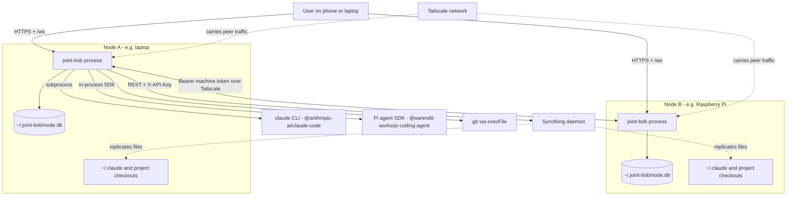
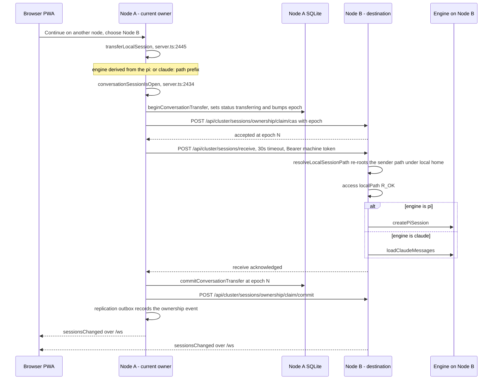
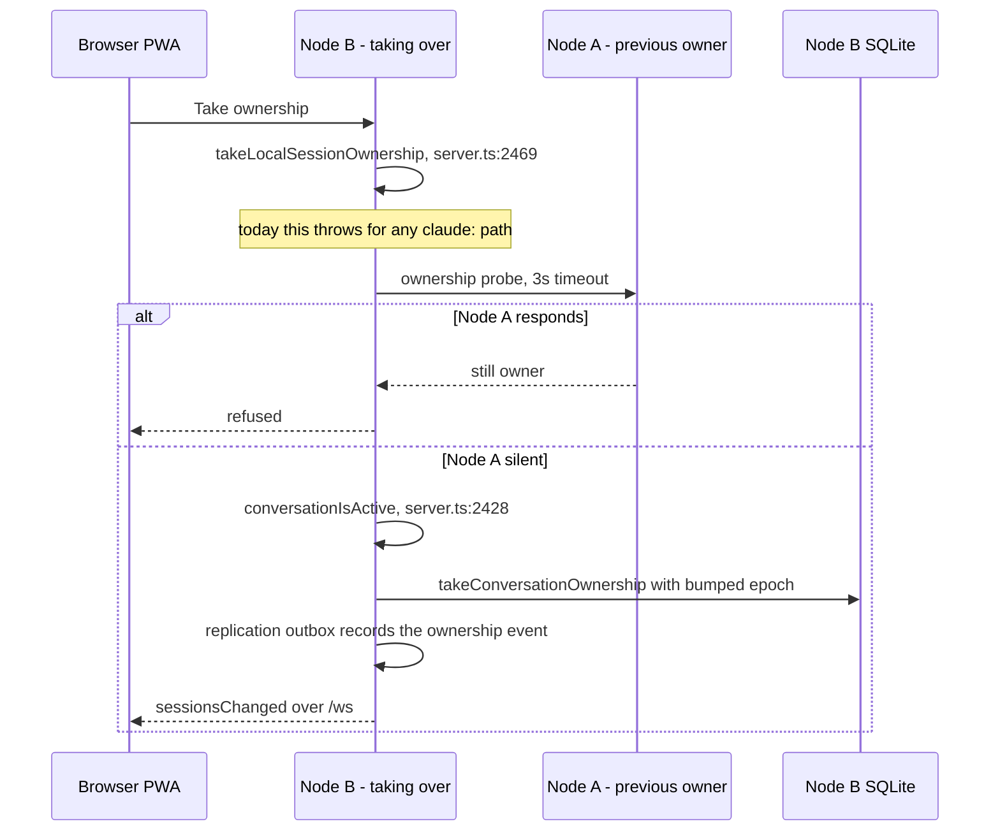
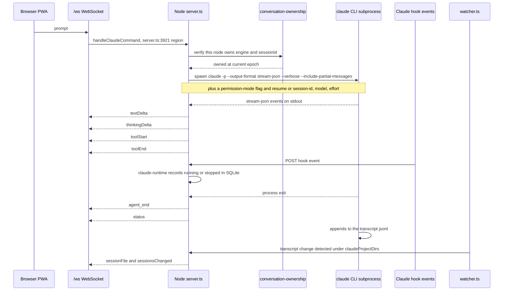
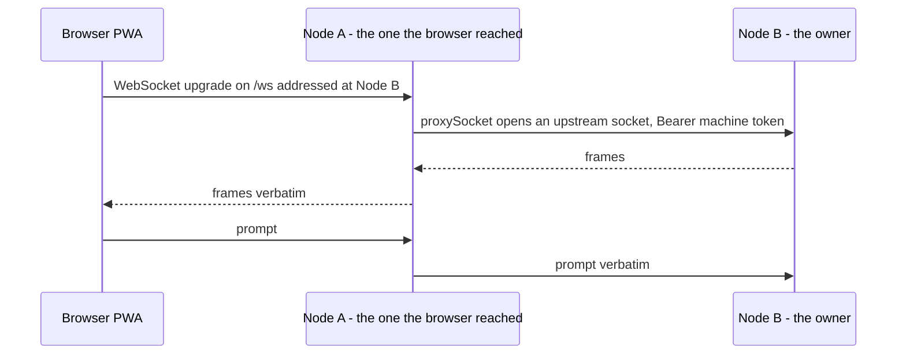

# Architecture

## Architectural Style

Joint Bob is a **replicated peer-to-peer mesh of identical modular monoliths**. Every node runs the same single Node.js process, exposing the same 105+ HTTP routes and the same `/ws` WebSocket endpoint, backed by its own local SQLite file. There is no leader, no shared database, no message broker and no service tier.

Evidence for the classification:

- One process per node: `src/server.ts` creates the Express app, attaches `new WebSocketServer({ server, path: "/ws" })`, and starts six background reconcilers in the same event loop.
- One datastore per node: every persistence module independently opens `~/.joint-bob/node.db` through `node:sqlite`'s `DatabaseSync` with `journal_mode = WAL` and `busy_timeout = 5000`. There is no connection pool and no shared DB handle.
- Peers are symmetric: the same binary serves the user's browser (cookie session + CSRF) and its sibling nodes (`Authorization: Bearer <machine token>` on ~40 routes under `/api/cluster/*`).
- Cross-node consistency is eventual and application-level: `src/replication.ts` maintains an event outbox/inbox; `src/cluster.ts` exchanges membership snapshots and tombstones.

Two mechanisms carry state between nodes, and the split matters:

| Layer | Carries | Mechanism | Consistency |
|---|---|---|---|
| File plane | Transcripts, project working trees, ticket workspaces | Syncthing folders provisioned via its REST API | Eventual, filesystem-level, out of the app's control |
| Control plane | Ownership, membership, tasks, GitHub credentials | HTTP `POST` to peers + replication outbox/inbox | Eventual, app-level, retried by reconcilers |

Conversation transfer is the one operation that must coordinate both planes at once, which is why it has its own state machine rather than riding on generic replication.

## System Context

*Text fallback:* the user's browser talks HTTPS and WebSocket to any node. Each node owns a private SQLite database and a local filesystem. Each node spawns the `claude` CLI as a subprocess and hosts the Pi agent SDK in-process. Nodes reach each other over Tailscale using Bearer machine tokens. Syncthing replicates `~/.claude` and project directories between nodes out-of-band; the app talks to the local Syncthing daemon over its REST API with an `X-API-Key`.

## Internal Component Structure

```mermaid
graph TD
    App["src/app.ts - test entry re-export"]
    Server["src/server.ts - routes, /ws, reconcilers"]
    App --> Server

    subgraph Engines["Engine layer"]
        Harn["src/harnesses.ts"]
        ClaudeSvc["src/claude-service.ts"]
        ClaudeRt["src/claude-runtime.ts"]
        PiSvc["src/pi-service.ts"]
        Paths["src/session-paths.ts"]
        Watch["src/watcher.ts"]
        Recov["src/update-recovery.ts"]
    end

    subgraph Mesh["Cluster layer"]
        Cluster["src/cluster.ts"]
        Repl["src/replication.ts"]
        Own["src/conversation-ownership.ts"]
    end

    subgraph Domain["Domain layer"]
        Store["src/store.ts"]
        Tasks["src/tasks.ts"]
        Work["src/worktrees.ts"]
        TaskWs["src/task-workspaces.ts"]
        Reviews["src/conversation-reviews.ts"]
        Locks["src/project-locks.ts"]
    end

    subgraph Platform["Platform layer"]
        Auth["src/auth.ts"]
        Audit["src/audit.ts"]
        Secrets["src/secrets.ts"]
        Gh["src/github-auth.ts"]
        Push["src/push.ts"]
        Settings["src/settings.ts"]
        Prefs["src/preferences.ts"]
        Sync["src/syncthing.ts"]
        Home["src/managed-home.ts"]
        Term["src/terminal-session.ts"]
    end

    Db[("node:sqlite - ~/.joint-bob/node.db")]

    Server --> Harn
    Server --> Own
    Server --> Repl
    Server --> Cluster
    Server --> Tasks
    Server --> Store
    Server --> Recov
    Server --> Term
    Server --> Sync
    Server --> Auth
    Server --> Reviews

    Harn --> ClaudeSvc
    Harn --> PiSvc
    ClaudeSvc --> Paths
    Watch --> Paths
    Tasks --> Cluster
    Tasks --> Repl
    Tasks --> Work
    Tasks --> TaskWs
    Tasks --> Audit
    Tasks --> Paths
    Repl <--> Own

    Own --> Db
    Store --> Db
    Cluster --> Db
    Tasks --> Db
    Auth --> Db
    ClaudeRt --> Db
    Reviews --> Db
```

*Text fallback:* `src/server.ts` is the hub, importing roughly 25 of the 32 sibling modules. Beneath it sit four groupings: an engine layer (harness registry, the Claude and Pi adapters, session-path derivation, the transcript watcher, update recovery), a cluster layer (membership, replication, conversation ownership), a domain layer (projects, tasks, worktrees, ticket workspaces, reviews, locks), and a platform layer (auth, audit, secrets, GitHub credentials, push, settings, preferences, Syncthing, managed home, terminal). Every persistence module opens the same SQLite file independently. `src/replication.ts` and `src/conversation-ownership.ts` import each other — a deliberate mutual import.

## Key Architectural Patterns

### Single-writer conversation ownership

`src/conversation-ownership.ts` implements a state machine keyed on `(engine, sessionId)` where `ConversationEngine = "pi" | "claude"` and the SQLite table carries `CHECK(engine IN ('pi', 'claude'))`. Each row holds an **epoch** and a **status**. The epoch is what makes a transfer safe under a lost acknowledgement: a stale owner that wakes up holding an old epoch loses to the node that fenced it.

The exported operations are `claimConversationOwnership`, `beginConversationTransfer`, `commitConversationTransfer`, `takeConversationOwnership`, `beginConversationRecovery` and `applyConversationOwnershipEvent`. **Every one of them takes `engine` as a parameter and contains no Pi-specific branch** — the layer is already engine-agnostic.

Compare-and-set is exposed over HTTP so peers can fence each other: `POST /api/cluster/sessions/ownership/claim`, `.../claim/cas`, `.../claim/commit`, `.../ownership/apply`.

### Engine adapter registry

`src/harnesses.ts` unifies Pi and Claude behind a common session listing/loading interface, importing `pi-service`, `claude-service` and `names`. Session identity is carried as a **prefixed path string** — `pi:/...` or `claude:/Users/a/.claude/projects/<encoded-cwd>/<sessionId>.jsonl`. That encoding is what `transferLocalSession` (`src/server.ts:2445`) uses to derive the engine, and it is why the transfer path is already engine-agnostic on the server.

### Replication outbox/inbox

`src/replication.ts` records domain events locally and pushes them to peers; peers apply them idempotently. Ownership changes ride this channel, which is why `replication.ts` and `conversation-ownership.ts` import each other.

### Files by Syncthing, not by the application

The application never copies a transcript between nodes. `src/syncthing.ts` provisions folders and ignore patterns; the `dot-claude` folder (`CLAUDE_ENGINE_SYNC_FOLDER_ID = "dot-claude"`, `src/syncthing.ts:41`, path `~/.claude`) mirrors the entire Claude state directory. This is why `POST /api/cluster/sessions/receive` can `await access(localPath, fsConstants.R_OK)` on a path derived from the *sender's* filesystem and still succeed — a property the current implementation depends on, and a fragile one.

### Zero-build client

`public/` is served by `express.static` with no bundler, no transpiler and no framework. Native browser ES modules, native `<dialog>`, a hand-rolled XSS-safe Markdown renderer (`public/markdown.js`) and a service worker with a manually pinned `CACHE_NAME` (currently `joint-bob-v52`).

## Interaction Diagrams

### Conversation ownership transfer and receive

This is the transaction the active intent extends to Claude. The sender fences the conversation, replicates the ownership change, hands the session to the destination, and commits.

*Text fallback:* the user picks a destination node. The owning node derives the engine from the session path prefix, checks no live socket is attached, marks the conversation `transferring` with a bumped epoch, compare-and-sets the claim on the destination, then calls `POST /api/cluster/sessions/receive` on the destination with a 30-second timeout. The destination re-roots the transcript path under its own home directory, verifies the file is readable, and opens it with the engine-appropriate loader — `createPiSession` for Pi, `loadClaudeMessages` for Claude. On acknowledgement the sender commits the transfer at the fenced epoch and records a replication event; both nodes then emit `sessionsChanged` to any attached browser.

**Where this breaks for Claude today.** `resolveLocalSessionPath` (`src/session-paths.ts:17`) splits the sender's path at the last `.claude` segment and re-roots the *entire remaining suffix* under the destination's home. For a Claude transcript that suffix is `projects/<encoded-source-cwd>/<sessionId>.jsonl`, where the encoding comes from `claudeProjectDir`'s `cwd.replace(/^\//, "-").replace(/[\s_.\/]+/g, "-")`. If the destination's checkout lives at a different absolute path, the resulting directory name is one Claude will never look in. Three consequences follow, in order:

1. `access(localPath, R_OK)` **succeeds anyway**, because Syncthing mirrors `~/.claude` wholesale.
2. `loadClaudeMessages` **reads it fine** — it only validates that the path sits inside `claudeProjectsRoot()`.
3. But `listClaudeSessions` (`src/claude-service.ts:177`) enumerates only `claudeProjectDirs(project, claudeProjectsRoot())`, derived from the destination's own `sessionCwds(project)` — so the transferred conversation **never appears in the destination's session list**; and `runClaudeTurn` (`src/server.ts:3921`) resumes with `resumeSessionId: connection.claude.sessionId` while spawning with `cwd: connection.cwd`, and `claude --resume <id>` locates the transcript through the directory derived from *that* cwd, which is not where the transferred file sits.

The building block a fix needs already exists: `claudeProjectDirs(project, projectsRoot)` (`src/session-paths.ts:49`) computes exactly the set of locally-correct directories — one per `sessionCwd` plus each parent — and already backs both `listClaudeSessions` and `sessionWatchDirs` (`src/watcher.ts:33`). Two cautions: it returns **multiple** candidates, so a selection rule is required; and `session-paths.ts` defaults its root to `~/.claude/projects` while `claude-service.ts` computes a settings-aware `claudeProjectsRoot()`.

### Forced takeover when the owner is unreachable

*Text fallback:* the user asks a non-owning node to seize a conversation. The node probes the recorded owner with a 3-second timeout. If the owner answers, the takeover is refused. If it is silent, the taking node checks that no conversation is locally active, bumps the epoch, writes itself in as owner, and records a replication event. Today `takeLocalSessionOwnership` throws `TaskWorktreeError("Only Pi conversations can be taken over")` on any `claude:` path and hardcodes `"pi"` in its subsequent `conversationIsActive(project.id, "pi", …)` and `takeConversationOwnership("pi", …)` calls — even though `conversationIsActive` and `conversationSessionIsOpen` (`src/server.ts:2428`, `:2434`) already handle `engine === "claude"` correctly via `activeClaudeConnections`.

### A chat turn

*Text fallback:* the browser sends a `prompt` message over `/ws`. The server verifies this node owns the conversation at the current epoch, then spawns the `claude` CLI with `-p --output-format stream-json --verbose --include-partial-messages`, a permission-mode flag, and either `--resume <id>` or `--session-id <id>`, plus optional `--model` and `--effort`. The subprocess streams JSON events which the server translates into `textDelta`, `thinkingDelta`, `toolStart` and `toolEnd` frames. Claude hook events arrive over HTTP and are recorded by `src/claude-runtime.ts` as running/stopped state in SQLite. When the process exits the server emits `agent_end` and `status`. Independently, the subprocess has appended to the transcript `.jsonl`; `src/watcher.ts` notices the change under the directories from `claudeProjectDirs(project)` and emits `sessionFile` / `sessionsChanged`. Note that `watcher.ts` calls `claudeProjectDirs(project)` **without** a root argument, so a node with a non-default `claude.configPath` watches the wrong directories while `listClaudeSessions` reads the right ones.

### Cross-node socket proxying

*Text fallback:* the browser only ever connects to whichever node it can reach. If the target conversation is owned elsewhere, that node's `proxySocket` opens an upstream WebSocket to the owner and relays frames verbatim in both directions. The browser never learns which node actually ran the turn.

## Data Architecture

There is exactly one datastore: `~/.joint-bob/node.db`, opened with `node:sqlite`'s `DatabaseSync`. There is no ORM, no query builder and no migration framework. Schema is established by `CREATE TABLE IF NOT EXISTS` at module load, and upgrades are hand-written `ALTER TABLE … RENAME TO …_old` / re-insert / `DROP` sequences — `ensureConversationOwnershipSchema` is the worked example. Every module ensures its own tables; there is no schema owner and no version table.

Rows come back from `node:sqlite` untyped, which the codebase bridges with 99 `as unknown as` casts concentrated in `tasks.ts` (35), `cluster.ts` (14), `store.ts` (12) and `github-auth.ts` (9). TypeScript `strict` mode gives no protection at that boundary.

Cryptography is all `node:crypto`: scrypt for passwords, AES for secrets, machine tokens, GitHub credentials and push keys, `timingSafeEqual` for token comparison. The state directory is `0o700` and its files `0o600`.

## Security Architecture

Three authentication classes are enforced by middleware in `src/server.ts`:

| Class | Mechanism | Surface |
|---|---|---|
| Unauthenticated | none | `GET /api/auth/status`, `GET /api/health`, `POST /api/auth/setup`, `POST /api/auth/login`, `GET /favicon.ico`, static assets |
| User session | signed cookie + CSRF middleware | all `/api/...` user-facing routes |
| Machine | `Authorization: Bearer <machine token>`, `timingSafeEqual`, sets `response.locals.machineAuth` | ~40 routes under `/api/cluster/*` |

Defence in depth beyond authentication: a `securityHeaders` middleware; zod validation on request bodies with a single terminal `app.use((error, ...))` handler; path-escape guards at every filesystem boundary — `resolveClaudeSessionPath`, `requirePathInsideHome`, `mappedPathInsideHome`, `managedFolderName`; symlink and regular-file checks before session deletion; and an append-only audit log (`src/audit.ts`).

The security implication most relevant to the active intent: the receive path's `access(localPath, R_OK)` check is a *readability* check, not an *ownership* check. It passes because Syncthing has mirrored the sender's directory tree verbatim. Any change to Claude path resolution must keep `loadClaudeMessages`'s existing invariant — that the resolved path lies inside `claudeProjectsRoot()` — rather than replacing it, or the transfer endpoint becomes an arbitrary-file-read primitive reachable with a machine token.

## Architectural Decisions Observed

Each entry below records a decision the code demonstrably makes, the alternatives the codebase's own structure shows were available, and the consequences already visible in the scan.

### AD-1: Files replicate out-of-band via Syncthing; the application replicates only control state

- **Context.** A conversation transcript must be readable on whichever node continues it. The transcripts are append-only `.jsonl` files written by an external process.
- **Decision.** Mirror `~/.claude` and project directories wholesale with Syncthing (`dot-claude` folder, `src/syncthing.ts:41`); the application never transfers a transcript byte itself.
- **Consequences.** The receive endpoint gets to assume the file already exists locally, which is why it only does `access(localPath, R_OK)`. The cost is that the application has no control over *when* the file arrives, no way to detect a partially-synced transcript, and — as recorded in project rule from 2026-08-28 — cannot trust filesystem mtime, because Syncthing rewrites it. The `newestEventTime` comment in the source records exactly this. It also produces Syncthing conflict files, which is why `src/session-paths.ts` carries dedicated Pi conflict recovery.
- **Alternatives rejected.** (a) *Application-level transcript push over the machine-token channel* — would give exact arrival semantics and remove the mtime problem, but duplicates a file-sync engine the product already requires for project checkouts. (b) *Central shared storage* — contradicts the product's no-central-server premise and would fail the moment a node is offline.

### AD-2: Single-writer ownership with an epoch, rather than last-write-wins or a distributed lock service

- **Context.** The same transcript file is present on every node. Two agents appending concurrently corrupts it. Nodes go offline without warning.
- **Decision.** An explicit `(engine, sessionId)` ownership row with an epoch and a status, fenced by a compare-and-set exposed at `POST /api/cluster/sessions/ownership/claim/cas`, plus a forced-takeover path for an unreachable owner.
- **Consequences.** Transfer survives a dropped acknowledgement and a service restart — `test/conversation-ownership-mesh-api.test.ts` boots two real nodes and exercises exactly those two failures. The cost is a bespoke state machine to maintain, and a takeover path that can strand a conversation if the network partitions rather than the node failing.
- **Consequences for security.** Fencing depends on the machine token being secret; there is no per-conversation authorisation beyond it.
- **Alternatives rejected.** (a) *Last-write-wins on the file* — simple, but the failure mode is a corrupted transcript with no recovery. (b) *An external lock service such as etcd or Consul* — correct, but adds a fourth mandatory system dependency alongside Tailscale, Syncthing and the agent runtimes, and needs a quorum the product's two-node common case cannot supply.

### AD-3: Engine identity encoded in the session path prefix

- **Context.** Two engines with different runtimes must share one conversation model, one ownership table and one transfer path.
- **Decision.** Carry engine as a `pi:` / `claude:` prefix on the session path string; derive it wherever needed (`transferLocalSession`, `src/server.ts:2445`) and branch only at the two leaves that genuinely differ — `createPiSession` versus `loadClaudeMessages` inside `POST /api/cluster/sessions/receive` (`src/server.ts:2668`).
- **Consequences.** The ownership layer, the replication layer and the transfer path are all engine-agnostic with no Pi-specific branch — which is precisely why the active intent's remaining work is three client gates, one server guard and one path-resolution fix rather than a new subsystem. The cost is that a path string doubles as a type discriminator, so path manipulation and engine dispatch are coupled; `resolveLocalSessionPath` splitting on the last `.claude` segment is the concrete symptom.
- **Alternatives rejected.** (a) *A separate table and route set per engine* — no shared invariants, and the ownership state machine would have to be written twice. (b) *A structured session descriptor object carried everywhere* — cleaner typing, but every persisted row, every replication event and every WebSocket frame currently carries the string, so the migration cost lands on the wire format and the SQLite schema at once.

### AD-4: `src/server.ts` as a single 4,712-line composition root

- **Context.** One process must serve HTTP, WebSocket chat, terminal proxying, cross-node proxying and six background reconcilers, over a domain whose modules all share one SQLite file.
- **Decision.** Keep all 105 routes, all WebSocket handling and all reconcilers in one file that imports ~25 of the 32 sibling modules.
- **Consequences.** Wiring is entirely visible in one place and there is no framework indirection to trace. The cost is that this is the largest structural risk in the repository: every intent-area change touches it, it exceeds any reasonable file-size budget, and test-only branches have leaked into it (`src/server.ts:2691`, `:3886`, `:3901`).
- **Alternatives rejected.** (a) *Split by route group into an Express router per domain* — mechanical and low-risk, but the modules genuinely share the reconciler loops and the socket registry, so the split would create a shared-context module anyway. (b) *A DI container or framework such as NestJS* — would impose structure, at the price of a build-time dependency and an abstraction layer the rest of the codebase deliberately avoids.

### AD-5: No client build step

- **Context.** A mobile-first PWA served directly by the Node process, installed onto user-owned hardware including a Raspberry Pi.
- **Decision.** Serve `public/` verbatim with `express.static`; native ES modules, native `<dialog>`, hand-rolled Markdown rendering, manually versioned service-worker cache.
- **Consequences.** Install is a file copy, there is no build toolchain to keep working on a Pi, and `npm run build` only ever runs `tsc` over `src/`. The cost is `public/app.js` at 4,776 lines and 226 functions with a single ~60-key mutable `state` object and no module boundaries, plus a `CACHE_NAME` bump that `AGENTS.md` mandates and nothing enforces.
- **Alternatives rejected.** (a) *A bundler with a framework* — would give module boundaries and cache-busting for free, at the cost of a build step in the install path and a dependency tree on constrained hardware. (b) *Native ES modules with a hand-split file layout but still no bundler* — retains the zero-build property and fixes the file size; the codebase already does this for `board.js` and `markdown.js`, so the pattern exists but has not been applied to `app.js`.

## Improvement Opportunities

1. **Decompose `src/server.ts`.** Extract the ownership/transfer region (lines 2370-2760) first: it is the intent-area surface, it is cohesive, and it would give the transfer state machine a testable home outside the route table.
2. **Unify Claude projects-root resolution.** `session-paths.ts` defaults to `~/.claude/projects` while `claude-service.ts` computes a settings-aware `claudeProjectsRoot()`, and `watcher.ts` calls `claudeProjectDirs(project)` with no root at all. One resolver, threaded through all three call sites.
3. **Delete the gitignored root-level duplicates.** `app.js`, `index.html`, `server.ts`, `styles.css` and `sw.js` at the repo root are stale copies from an older layout and are an active trap for greps and agents.
4. **Add push/PR CI.** Tests run only on `v*` tags today; a change can reach `main` and, via the `pre-push` hook, reach installed production nodes with no automated test run.
5. **Move the test-only branches out of the shipped transfer handler.** `JOINT_BOB_TEST_DROP_TRANSFER_ACK_ONCE` and the two engine-hold hooks are guarded by `NODE_ENV === "test"` but live inside the receive path.
