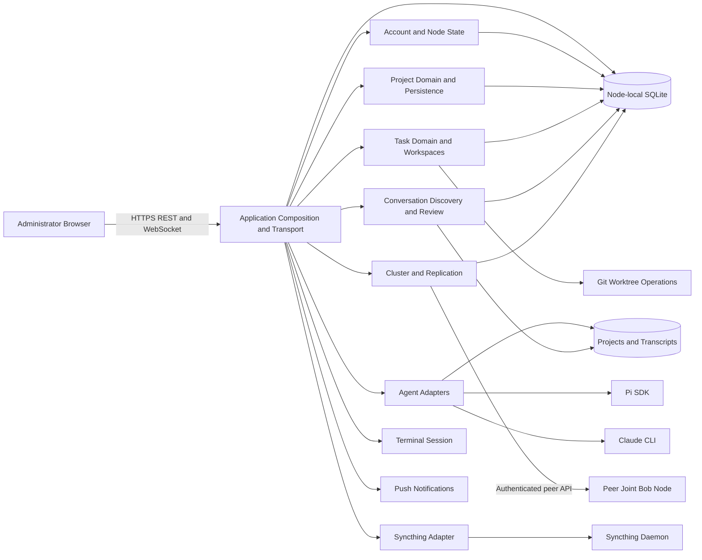
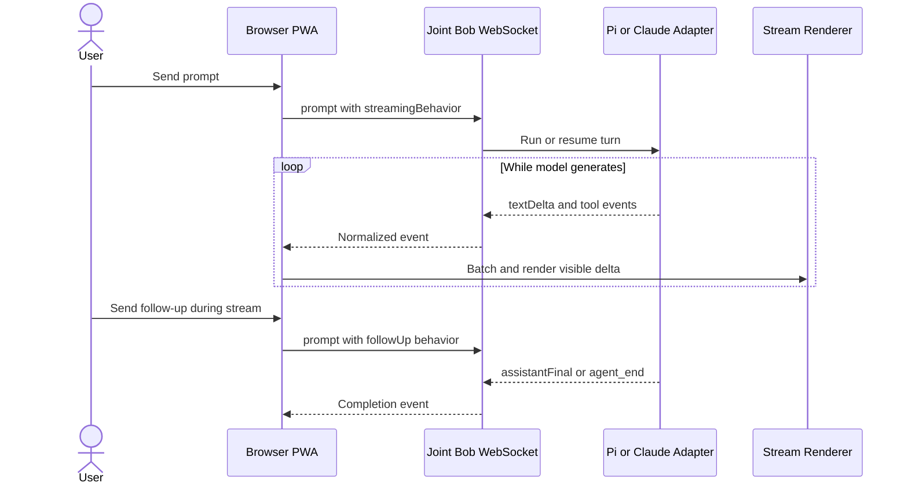
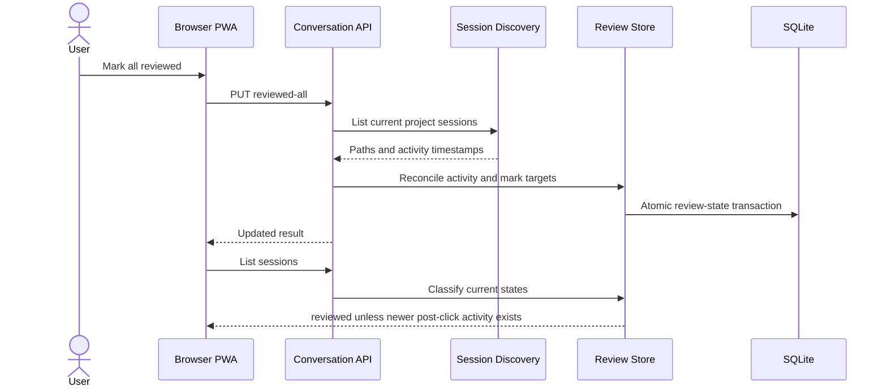
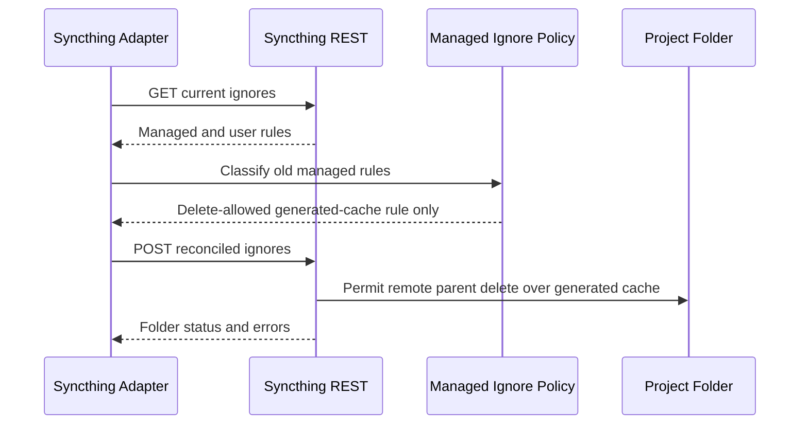
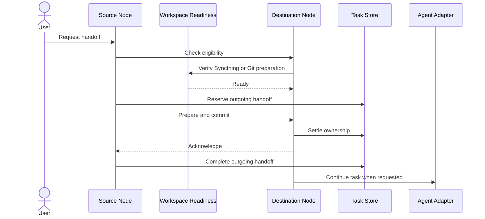

# Architecture

## System Overview

Joint Bob is a stateful Node.js modular monolith deployed independently on each participating machine. One process hosts an Express REST API, a `ws` WebSocket endpoint, the static PWA, peer proxying, background reconciliation, agent execution, terminal attachment, and startup readiness. Nodes communicate directly over authenticated HTTP/WebSocket; Syncthing replicates selected filesystem trees outside the process.

Source modules separate domain and integration concerns, but deployment and data boundaries remain shared. Most persistent modules open the same node-local SQLite file, while repositories, transcripts, worktrees, ticket workspaces, and synchronized data remain on disk.

## Component Architecture

<!-- Plain-text fallback: The browser reaches one Joint Bob process. That process composes account, project, task, review, agent, cluster, synchronization, terminal, push, Git, SQLite, and filesystem components, and calls peer nodes, Syncthing, Pi, and Claude through adapters. -->

The dominant style is a modular monolith with peer-to-peer cluster behavior and event-driven streaming inside persistent WebSocket connections. It is not a microservice system: components deploy together, share process memory, and share SQLite.

## Data Ownership and Flow

| Data | Logical owner | Storage/movement |
|---|---|---|
| Users, login sessions, preferences, settings, audit | Account and node state | `~/.joint-bob/node.db`; sensitive values encrypted |
| Projects, aliases, types, locks, names, locations | Project domain | SQLite plus filesystem paths; selected records replicate |
| Tasks, leases, handoffs, tombstones | Task domain | SQLite transactions and authenticated peer messages |
| Review state | Conversation discovery/review | Per-user/project/session SQLite rows |
| Repositories, worktrees, ticket workspaces | Filesystem/Git/task workspace components | Local disk; selected trees use Syncthing |
| Pi/Claude transcripts | Agent engines | Engine-owned files discovered and watched by Joint Bob |
| GitHub, machine, push, and settings secrets | Owning credential modules | AES-256-GCM encrypted SQLite values with node-local key |
| PWA shell | Browser PWA/service worker | `public/`; app-shell cache `joint-bob-v34` |

Data ownership is logical rather than physically isolated. Independent module-owned schema setup against one SQLite file makes startup order and migration correctness cross-component concerns.

## Interaction Diagrams

### Stream and Steer an Agent Turn

<!-- Plain-text fallback: A prompt enters through the browser WebSocket, the Pi or Claude adapter emits deltas, the server forwards each normalized event, and the browser batches and paints it. The user can queue a follow-up before the final completion event. -->

**Risk:** the intended chain exists, but no timing-aware browser test proves that an intermediate delta paints before completion. Commit `9ab9b04` changed long-message batching and is the highest-risk regression area, not a confirmed root cause.

### Mark All Conversations Reviewed

<!-- Plain-text fallback: The bulk route must discover current sessions, reconcile their latest activity, and advance review timestamps in one server-controlled operation. A later list should stay reviewed unless genuinely newer activity occurred after the click. -->

**Current defect hypothesis:** `markConversationsReviewed()` advances `reviewed_at` only to stored `last_activity_at`. Activity not synchronized before the mark can make the next listing return `needs_review` again.

### Reconcile Syncthing Project Ignores

<!-- Plain-text fallback: Joint Bob reads existing ignores, separates managed rules from user rules, migrates only the proven generated-cache rule to delete-allowed semantics, writes the exact reconciled list, and checks folder status. -->

The live `beecomm` folder had 55 pull errors because remotely deleted directories contained ignored `__pycache__` content. The fix boundary must not grant delete permission to credentials, environment files, logs, source, or arbitrary user ignores.

### Hand Off Task Ownership

<!-- Plain-text fallback: Source and destination verify eligibility and workspace readiness, reserve and commit a handoff, settle ownership on the destination, acknowledge it, and then allow execution on the new owner. -->

## Architectural Decisions

These are observed/recommended directions, not historical ADRs. No repository ADR set documents the original decisions.

### AD-1: Preserve the Stateful Modular Monolith

**Decision:** Keep one Node.js deployable per machine and improve internal boundaries rather than splitting services for the active fixes.

**Consequences:** Installation and local debugging remain simple; all capabilities still scale and fail together; `server.ts` remains a coupling hotspot until transaction orchestration is extracted behind internal interfaces.

**Alternatives:**
1. **Microservices per domain:** improves independent deployment and isolation, but adds service discovery, distributed transactions, observability, and credential distribution without a proven scaling need.
2. **Serverless control plane:** can scale sporadic HTTP work, but conflicts with long-lived WebSockets, local repositories, agent subprocesses, terminals, and node-local SQLite.

**Security/compliance:** One private-network process reduces exposed service endpoints, but a compromised administrator session has broad filesystem and agent reach. No compliance regime is documented; future separation would require explicit data-flow and credential-boundary review.

### AD-2: Keep Event-Driven WebSocket Streaming

**Decision:** Repair and test the SDK/CLI → normalized WebSocket → browser-render path.

**Consequences:** Steering remains low latency and uses existing authentication. Timing-aware tests are harder than source-contract tests, and reconnect replay must avoid duplication.

**Alternatives:**
1. **Poll transcript files:** simpler browser state but increases filesystem reads and delays steering.
2. **Add a second streaming service/port:** could isolate throughput, but duplicates authentication and creates another exposed boundary.

**Security/compliance:** Preserve cookie authentication, same-origin checks, machine bearer checks, and bounded attachment validation. Never make `/ws` anonymous to solve reconnect or streaming latency.

### AD-3: Reconcile Review Activity Server-Side and Atomically

**Decision:** Use current server-observed session activity when advancing per-user review state.

**Consequences:** Cross-tab behavior becomes deterministic and stale clients cannot suppress real activity. The operation must define a clear click-time boundary so post-click activity still becomes `needs_review`.

**Alternatives:**
1. **Client retry/optimistic suppression:** improves appearance but leaves stale persistence and fails across tabs/nodes.
2. **Replicate review state cluster-wide:** could unify reading state, but leaks per-user behavior and adds conflict resolution without a requirement.

**Security/compliance:** Keep review rows scoped by `user_id`, `project_id`, and `session_path`. Review behavior is user activity data; do not replicate it without an explicit privacy requirement.

### AD-4: Use Delete-Allowed Ignores Only for Proven Generated Caches

**Decision:** Migrate the managed Python `__pycache__` rule to Syncthing delete-allowed semantics and remove the obsolete managed form.

**Consequences:** Remote parent deletion can clear generated bytecode and folder errors stop recurring. Misclassification could delete local ignored data, so matching must be exact and regression-tested.

**Alternatives:**
1. **Manual cache cleanup and rescan:** resolves current files but errors recur after caches return.
2. **Apply `(?d)` to all ignores:** removes many conflicts but creates unacceptable credential and data-loss risk.

**Security/compliance:** Never apply delete-allowed semantics to `.env`, keys, credentials, logs, source, all ignored files, or user-authored rules. This is a destructive synchronization permission, not cosmetic syntax.

## Architectural Risks and Improvement Opportunities

- Split route registration and business orchestration out of `src/server.ts` only when active change pressure proves the boundary; do not create speculative services.
- Isolate stream-render scheduling behind browser-testable behavior and add real timing assertions for Pi and Claude.
- Centralize ordered SQLite migrations or at least a schema ledger; preserve mode-`0600` database and backup permissions.
- Publish a shared REST/WebSocket contract before adding more browser/server enum duplication.
- Enforce realpath/lstat containment for project-file reads; lexical checks alone follow symlinks.
- Sanitize unexpected HTTP 500 messages before returning them to authenticated clients.
- Add HTTPS/private-address policy or explicit warnings for peer URLs to reduce SSRF and machine-token exposure.

## Assumptions and Evidence Limits

- **Assumption:** The active streaming symptom is in browser batching or an upstream timing boundary; the scan did not capture runtime timestamps.
- **Evidence:** The review race follows directly from current persistence semantics, but exact user timing still needs a targeted regression.
- **Evidence:** Syncthing's live API errors explicitly name ignored generated content as the blocked-delete cause.
- **Unknown:** Throughput, availability targets, retention requirements, and formal compliance obligations are not documented.
