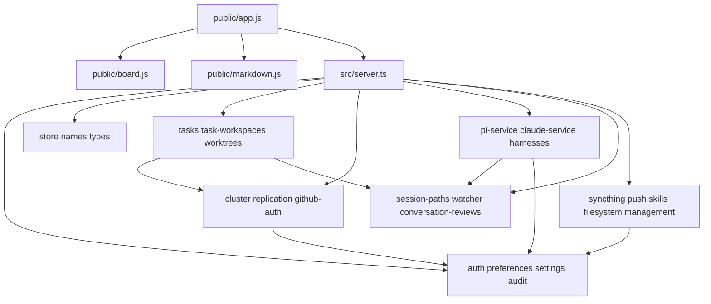

# Dependencies

## External runtime dependencies

| Dependency | Consumer | Contract | Operational effect |
|---|---|---|---|
| Pi coding-agent SDK | `src/pi-service.ts`, `src/harnesses.ts`, `src/server.ts` | In-process sessions, models, prompts, tools, safeguards, events | Pi availability and credentials are node-local |
| Claude Code CLI | `src/claude-service.ts`, `src/harnesses.ts`, `src/server.ts` | Spawned stream-JSON process and JSONL transcripts | Executable, config, credentials, model and effort support vary by node |
| Syncthing REST and daemon | `src/syncthing.ts` | Device, folder, ignore, status, scan APIs | Required for project and ticket-workspace synchronization |
| Git executable | `src/worktrees.ts`, deployment scripts | Worktrees, bundles, merge, commit packaging | Required for legacy Git-backed tasks and exact-commit deployment |
| Peer Joint Bob nodes | `src/server.ts`, cluster modules | Bearer-authenticated REST and proxied WebSockets | Adds network, mapping, membership, retry, and partial-failure boundaries |
| Web Push service | `src/push.ts` | VAPID Push API | Completion delivery depends on browser subscription and push network |
| Local filesystem | Most modules | Projects, transcripts, skills, workspaces, runtime config | Permissions, path identity, symlinks, and sync changes affect correctness |
| SQLite file | Persistence modules | Synchronous `node:sqlite` connections to `~/.joint-bob/node.db` | Shared schema and write contention across module-owned handles |
| Tailscale Serve | Operations only | Private HTTPS proxy | Recommended access and origin for phones and peers |
| AWS | `deploy/aws-ec2-test` | Temporary EC2 test environment | Used for smoke testing, not the normal production topology |

## npm dependency roles

### Production dependencies

- `express` provides HTTP routing, middleware, and static serving.
- `ws` provides server, client, and proxy WebSockets.
- `zod` validates untrusted HTTP and socket input.
- `@earendil-works/pi-coding-agent` provides the embedded Pi runtime.
- `@anthropic-ai/claude-code` packages the Claude executable.
- `nanoid` creates application identifiers.
- `web-push` manages VAPID and notification delivery.

### Development dependencies

- TypeScript and `@types/*` packages typecheck and compile backend code.
- `tsx` loads TypeScript for development and Node tests.

The two committed lockfiles are identical but create a manual synchronization obligation. The lock contains 279 transitive entries. Individual transitive packages were not all reviewed. The npm registry returned HTTP 400 during the attempted audit, so dependency vulnerability status is unverified.

## Internal dependency structure

`src/server.ts` has the broadest fan-out and is the only module that composes full business transactions. Most dependencies point toward utility or persistence modules, but shared SQLite state and server-owned orchestration prevent strict layer isolation.

## Important internal chains

### Conversation execution

`public/app.js` -> `/ws` in `src/server.ts` -> selected-node proxy or task-owner proxy -> `harnesses.ts` plus `pi-service.ts` or `claude-service.ts` -> project and transcript filesystem.

Model configuration crosses the same chain. Pi `setModel` and thinking commands call SDK session methods. Claude `setModel` and `setEffort` update connection state, then `claude-service.ts` turns them into CLI arguments on the next prompt.

### Task execution and handoff

`public/app.js` and `public/board.js` -> project task REST or task WebSocket -> `tasks.ts` -> `task-workspaces.ts` or `worktrees.ts` -> `syncthing.ts` and peer routes -> destination `tasks.ts` -> agent adapter.

Task phase data depends on `types.ts` and Zod schemas in `server.ts`. `effort` is stored for each phase, while current task editor options encode only `default` and provide no separate effort selector.

### Project import and synchronization

Project API -> `managed-home.ts` -> `project-directory-import.ts` -> `store.ts` -> `syncthing.ts` -> peer Syncthing device. Project names and mappings also feed `names.ts`, `replication.ts`, and cluster inventory.

### Authentication and secrets

Express middleware -> `auth.ts` -> `audit.ts` and SQLite. Settings, cluster tokens, GitHub credentials, and push keys each depend on AES-GCM key handling, but four modules implement overlapping helpers independently.

## Persistence coupling

At least the following components open the same `node.db`: audit, authentication, cluster, conversation reviews, GitHub auth, names, preferences, push, replication, settings, store, and tasks. WAL helps concurrent access, but each module controls some combination of connection lifecycle, busy timeout, schema creation, and guarded alterations.

The code declares 43 tables and 23 guarded `ALTER TABLE` operations without a central schema version. A startup ordering or partial migration failure can therefore cross module boundaries even when the source imports look acyclic.

## Build and deployment dependencies

- `src/**/*.ts` depends on TypeScript compilation; `public/` does not.
- `src/app.ts` imports `src/server.ts`, so API tests load the full composition root.
- `npm start` depends on a successful build every start.
- `prepack` depends on the build and publishes source plus compiled-at-install expectations through package metadata.
- Release automation depends on npm install, typecheck, tests, build, package smoke checks, GitHub Releases, and npm provenance publication.
- Installed-node deployment depends on Git commit availability, tar packaging, SQLite backup, service manager access, and release health verification.
- EC2 smoke tests depend on Terraform, the AWS provider, Instance Connect, and operator `/32` ingress.

## Dependency risk notes

- Claude and Pi run with broad local filesystem and subprocess capability. Claude explicitly bypasses permission prompts; Pi safeguards are mutable per session.
- Peer operations rely on private HTTPS and bearer tokens. Pairing over public HTTP is documented as unsafe.
- Filesystem identity is central to project and conversation isolation. Legacy aliases and broad discovery paths make path handling a cross-cutting dependency.
- The project-file route follows symlinks after lexical containment checking.
- The native frontend manually mirrors server contracts, model enums, task phase shapes, and event names.
