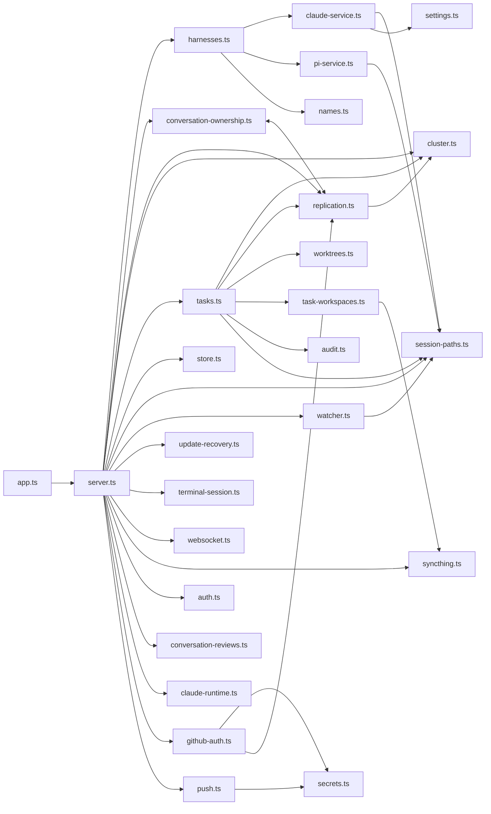

# Dependencies

## External npm Dependencies

Seven runtime dependencies, six dev dependencies. Declared range → version resolved in `npm-shrinkwrap.json`, which is the lockfile that ships in the published tarball.

### Runtime

| Package | Declared | Resolved | Used by | Replaceability |
|---|---|---|---|---|
| `express` | `^4.19.2` | 4.22.2 | `src/server.ts` | Deeply embedded — 105 route handlers, 5 middleware mounts, one terminal error handler |
| `ws` | `^8.18.0` | 8.21.3 | `src/server.ts`, `src/websocket.ts`, `src/terminal-session.ts` | Deeply embedded — the `/ws` server and `proxySocket` |
| `zod` | `^3.23.8` | 3.25.76 | `src/server.ts`, `src/conversation-ownership.ts` (`ownershipPayload`) | Every request body and every replicated payload |
| `nanoid` | `^5.0.7` | 5.1.16 | id generation | Trivially replaceable by `node:crypto` |
| `web-push` | `^3.6.7` | 3.6.7 | `src/push.ts` | Isolated to one module |
| `@anthropic-ai/claude-code` | **pinned** | 2.1.239 | spawned as a subprocess from `src/server.ts` and `src/claude-service.ts` | Product contract, not an implementation detail |
| `@earendil-works/pi-coding-agent` | **pinned** | 0.84.2 | in-process from `src/pi-service.ts` | Product contract, not an implementation detail |

Both engine packages are exact-pinned rather than ranged. `scripts/versions.sh` additionally pins the engine versions alongside Node 22.23.2, so the installer and CI agree on exactly which agent build a node runs.

### Development

| Package | Declared | Resolved | Role |
|---|---|---|---|
| `typescript` | `^5.7.2` | 5.9.3 | `tsc` — the sole enforced quality gate |
| `tsx` | `^4.19.2` | 4.23.12 | `dev` watch mode; loads TypeScript tests via `node --import tsx` |
| `@types/node` | 22.x | | |
| `@types/express` | 4.17.x | | |
| `@types/ws` | 8.5.x | | |
| `@types/web-push` | 3.6.x | | |

### Deliberately absent

No linter, formatter, bundler, test framework, assertion library, coverage tool, ORM, query builder, migration tool, DI container, or client-side framework. Tests use Node's built-in `node:test` and `node:assert/strict`; the datastore is Node's built-in `node:sqlite`; cryptography is `node:crypto`.

## External System Dependencies

Not npm packages. The product does not function without them, and none of them is version-negotiated by the application.

| System | Required for | Failure mode if absent |
|---|---|---|
| **Tailscale** | Peer reachability | Nodes cannot see each other; the cluster degrades to isolated single nodes |
| **Syncthing** | Replicating `~/.claude` (`dot-claude`, `src/syncthing.ts:41`) and project directories | Transfer's `access(localPath, R_OK)` check fails on the destination; ticket workspaces stop propagating |
| **`claude` CLI** | The Claude engine | Claude conversations cannot be started or resumed |
| **Pi agent SDK** | The Pi engine | present as an npm dependency, so this is a load failure rather than a missing system |
| **`git`** | Worktree and bundle task handoff | Legacy handoff path fails |
| **User `$SHELL`** | Terminal channel | Terminal tab fails to attach |
| **Node.js ≥ 22.19.0** | `node:sqlite`, `node:test`, native fetch | Server will not start |

**The Syncthing dependency is load-bearing for the active intent.** Claude transcript transfer currently works at the file level only because Syncthing mirrors the entire `~/.claude` directory tree, sender-encoded project directory names included. That is what lets `POST /api/cluster/sessions/receive` pass an `access(localPath, R_OK)` check on a path derived from the *sender's* filesystem layout.

## Internal Module Dependency Graph

*Text fallback:* `src/app.ts` re-exports `src/server.ts`, which imports roughly 25 of the 32 sibling modules and is the only importer of most of them. `harnesses.ts` fans out to `claude-service.ts`, `pi-service.ts` and `names.ts`. Both engine adapters and `watcher.ts` depend on `session-paths.ts`. `conversation-ownership.ts` and `replication.ts` import each other. `tasks.ts` is the second-largest fan-out, depending on `cluster`, `replication`, `worktrees`, `task-workspaces`, `audit` and `session-paths`. `github-auth.ts` and `push.ts` both depend on `secrets.ts`.

## Notable Coupling Facts

### `src/server.ts` is a hub with a fan-in of one

It imports ~25 of 32 modules and is imported by exactly one file (`src/app.ts`). Every intent-area change lands in it. This is the dominant coupling fact in the repository.

### `conversation-ownership.ts` ↔ `replication.ts` is a deliberate cycle

Ownership changes must be replicated, and replicated events must be applied to ownership. The cycle is intentional and is the only one in `src/`.

### `session-paths.ts` has no internal dependencies and four dependents

It is imported by `claude-service.ts`, `pi-service.ts`, `watcher.ts`, `tasks.ts` and `server.ts` while importing nothing internal. That makes it the cheapest place in the codebase to change path behaviour — and the widest blast radius if the change is wrong. The active intent's path fix lands here.

### Three call sites disagree about the Claude projects root

| Call site | Root used |
|---|---|
| `src/claude-service.ts` `listClaudeSessions` (line 177) | `claudeProjectsRoot()` — settings-aware, honours `settings.claude.sessionPath` / `configPath` |
| `src/claude-service.ts` `loadClaudeMessages` | validates against `claudeProjectsRoot()` |
| `src/watcher.ts` `sessionWatchDirs` (line 33) | `claudeProjectDirs(project)` with **no root** — falls back to `session-paths.ts`'s default `~/.claude/projects` |
| `src/session-paths.ts` `claudeProjectDir` default | `~/.claude/projects` |

On a node with a non-default `claude.configPath`, the watcher watches directories the lister never reads. Latent today; directly adjacent to the intent's fix.

### Every persistence module opens the database independently

There is no shared handle, no schema owner and no version table. `store.ts`, `cluster.ts`, `tasks.ts`, `auth.ts`, `audit.ts`, `secrets.ts`, `github-auth.ts`, `push.ts`, `settings.ts`, `preferences.ts`, `project-locks.ts`, `conversation-reviews.ts`, `claude-runtime.ts`, `update-recovery.ts` and `conversation-ownership.ts` each call `new DatabaseSync` and run their own `CREATE TABLE IF NOT EXISTS` at module load. Coupling is therefore through the *schema*, invisible to the import graph.

### Two overlapping handoff mechanisms both hang off `tasks.ts`

`worktrees.ts` (Git bundle/worktree, documented in `README.md` as legacy) and `task-workspaces.ts` (Syncthing ticket workspaces, current). Both must be maintained because `README.md` keeps the worktree path documented rather than removed.

### Client dependencies

`public/app.js` imports `public/board.js` and `public/markdown.js`. There are no other client module boundaries — `app.js` is otherwise a single 4,776-line file. `public/boot.js` and `public/sw.js` are standalone. No client-side npm dependency exists at all.
