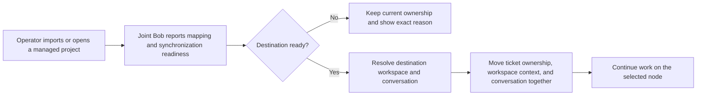

# Scope definition

## Inputs and decision basis

This scope implements the approved `intent-statement.md` boundary and the autonomous answers recorded in `scope-definition-questions.md`. The requesting project owner approved one coherent change covering project imports, managed group moves, synchronization readiness, active-agent visibility, and portable ticket conversations. [intent] [Q1] [Q2]

## Outcome

Operators can organize and use managed projects across Joint Bob nodes without guessing whether synchronized state is safe. Ticket ownership, its synchronized workspace, and its existing conversation move together when either **Runs on** or **Continue on** selects a ready destination. [intent] [Q2]

## In scope

- Make **Move + symlink** the default import mode while retaining all three import choices. [intent] [Q2]
- Let an operator change a managed project's group and move its managed directory without losing files or breaking the managed path. [intent] [Q2]
- Show each project's synchronization readiness so an operator knows when work can safely start. [intent] [Q2]
- Show the active agent for every session. [intent] [Q2]
- Make **Runs on** and **Continue on** available for ticket conversations. Either action performs one ticket handoff that preserves ticket ownership, the synchronized workspace, and the same conversation. [intent] [Q2]
- Resolve ticket workspace and conversation locations for the destination node before ownership changes. [Q3]
- Keep ownership on the current node and show the exact blocking reason when the destination is offline, unmapped, or unsynchronized. [intent] [Q3] [Q6]
- Validate a real ticket handoff from MacBook Pro to Homeserver and back after automated checks pass. [Q7]

## Out of scope

- Queueing a handoff until an unready destination later becomes ready. [Q6]
- Forcing ownership changes while a destination is offline, unmapped, or unsynchronized. [Q6]
- Re-pairing healthy nodes or replacing the existing synchronization system without evidence that either is broken. [Q6]
- Removing any existing project import choice. [intent]
- Deployment, commit, or push without separate authorization. [Q6]

## Dependency and sequencing boundary

Delivery follows risk-first sequencing. Destination readiness, project mapping, and node-local path resolution must be trustworthy before ticket controls can change ownership. User controls become actionable only after the handoff path fails closed with exact reasons. [Q3] [Q4]

The remaining project-readiness capabilities can then land as independently testable slices, but all are required before this initiative is complete. There is no hard deadline that justifies weakening readiness checks or splitting the approved boundary. [Q1] [Q2] [Q5]

## Acceptance boundary

The initiative is complete when:

- new import flows default to **Move + symlink** and still offer every existing mode;
- managed project group changes preserve files and the managed path;
- every project exposes synchronization readiness;
- every session exposes its active agent;
- ticket **Runs on** and **Continue on** both perform the same safe handoff;
- blocked handoffs keep current ownership and display the exact reason;
- the ticket's workspace and existing conversation open on the destination node;
- automated tests, type checking, build checks, and a MacBook Pro to Homeserver round trip pass. [intent] [Q7]

## Value stream

## Assumptions and open questions

None.

## Sources

- [intent] `../intent-capture/intent-statement.md`
- [Q1]-[Q7] `scope-definition-questions.md`
